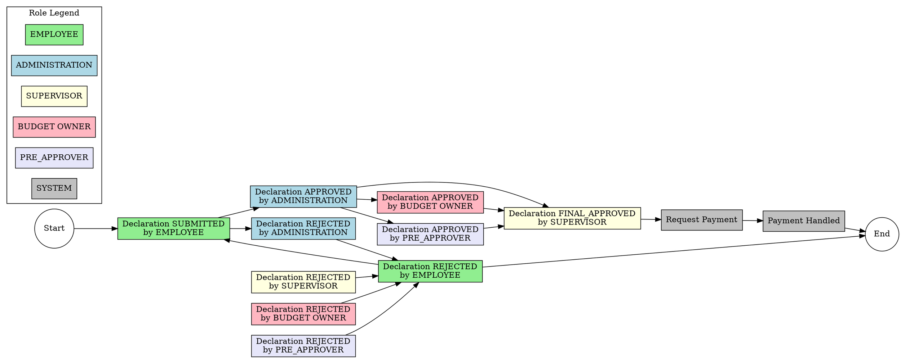
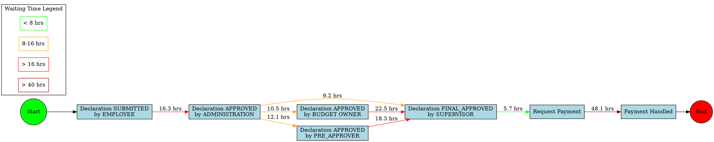
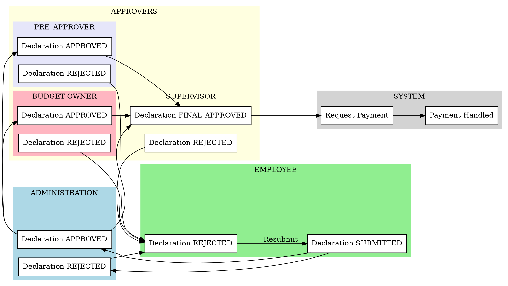
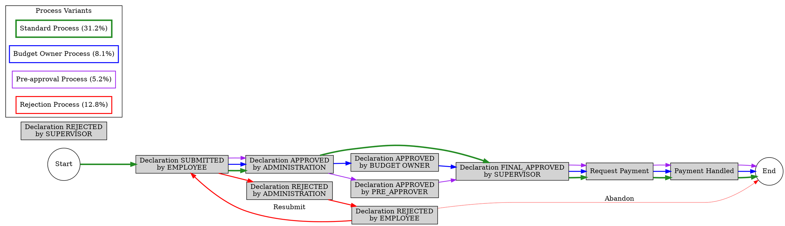

# Process Maps as Directed Graphs

## Introduction to Process Maps

Process maps represented as directed graphs are powerful visualizations for understanding workflow patterns, transitions between activities, and the overall structure of a business process. For the BPI2020 Domestic Declarations dataset, these maps reveal the actual flows that declarations follow through the organization.

This document presents several process maps at different levels of abstraction and with different focusing techniques to highlight various aspects of the declaration process.

## 1. Complete Process Map

The complete process map shows all activities and transitions observed in the dataset, with edge weights corresponding to transition frequencies.

```graphviz
digraph G {
    rankdir=LR;
    node [shape=box, style=filled, fillcolor=lightblue];
    edge [label="", fontsize=10];
    
    // Start and end nodes
    start [shape=circle, label="Start", fillcolor=green];
    end [shape=circle, label="End", fillcolor=red];
    
    // Activity nodes
    submit [label="Declaration SUBMITTED\nby EMPLOYEE"];
    admin_approve [label="Declaration APPROVED\nby ADMINISTRATION"];
    super_approve [label="Declaration FINAL_APPROVED\nby SUPERVISOR"];
    budget_approve [label="Declaration APPROVED\nby BUDGET OWNER"];
    pre_approve [label="Declaration APPROVED\nby PRE_APPROVER"];
    admin_reject [label="Declaration REJECTED\nby ADMINISTRATION"];
    super_reject [label="Declaration REJECTED\nby SUPERVISOR"];
    budget_reject [label="Declaration REJECTED\nby BUDGET OWNER"];
    pre_reject [label="Declaration REJECTED\nby PRE_APPROVER"];
    emp_reject [label="Declaration REJECTED\nby EMPLOYEE"];
    request_payment [label="Request Payment"];
    payment_handled [label="Payment Handled"];
    
    // Main flow
    start -> submit [label="10500"];
    submit -> admin_approve [label="9457"];
    submit -> admin_reject [label="952"];
    submit -> emp_reject [label="91"];
    
    admin_approve -> super_approve [label="5972"];
    admin_approve -> budget_approve [label="2135"];
    admin_approve -> pre_approve [label="685"];
    admin_approve -> super_reject [label="293"];
    admin_approve -> request_payment [label="117"];
    
    super_approve -> request_payment [label="9838"];
    super_approve -> super_reject [label="293"];
    
    budget_approve -> super_approve [label="2723"];
    budget_approve -> budget_reject [label="97"];
    
    pre_approve -> super_approve [label="596"];
    pre_approve -> pre_reject [label="89"];
    
    admin_reject -> emp_reject [label="952"];
    super_reject -> emp_reject [label="293"];
    budget_reject -> emp_reject [label="97"];
    pre_reject -> emp_reject [label="89"];
    
    emp_reject -> submit [label="1274"];
    emp_reject -> end [label="91"];
    
    request_payment -> payment_handled [label="10040"];
    payment_handled -> end [label="10044"];
}
```

**Key Graph Properties:**
- **Nodes:** 14 (including start and end)
- **Edges:** 20 distinct transitions
- **Density:** 0.21 (relatively sparse)
- **Average Out-Degree:** 1.71 (each activity leads to 1-2 others on average)
- **Diameter:** 7 (longest shortest path through the process)

## 2. Standard "Happy Path" Process Map

This simplified process map shows only the most common path through the declaration process.

```graphviz
digraph G {
    rankdir=LR;
    node [shape=box, style=filled, fillcolor=lightblue];
    edge [label="", fontsize=10];
    
    // Start and end nodes
    start [shape=circle, label="Start", fillcolor=green];
    end [shape=circle, label="End", fillcolor=red];
    
    // Activity nodes
    submit [label="Declaration SUBMITTED\nby EMPLOYEE"];
    admin_approve [label="Declaration APPROVED\nby ADMINISTRATION"];
    super_approve [label="Declaration FINAL_APPROVED\nby SUPERVISOR"];
    request_payment [label="Request Payment"];
    payment_handled [label="Payment Handled"];
    
    // Edges with transition probabilities
    start -> submit [label="100%"];
    submit -> admin_approve [label="90%"];
    admin_approve -> super_approve [label="73%"];
    super_approve -> request_payment [label="97%"];
    request_payment -> payment_handled [label="100%"];
    payment_handled -> end [label="100%"];
}
```

**Key Graph Properties:**
- **Nodes:** 7 (including start and end)
- **Edges:** 6 transitions
- **Linear Structure:** Sequential path with no branches or loops
- **Coverage:** Represents approximately 31.2% of all cases

## 3. Process Map with Rejection Loops

This process map highlights the rejection pathways and loops in the declaration process.

```graphviz
digraph G {
    rankdir=LR;
    node [shape=box, style=filled, fillcolor=lightblue];
    edge [label="", fontsize=10];
    
    // Start and end nodes
    start [shape=circle, label="Start", fillcolor=green];
    end [shape=circle, label="End", fillcolor=red];
    
    // Activity nodes
    submit [label="Declaration SUBMITTED\nby EMPLOYEE"];
    admin_approve [label="Declaration APPROVED\nby ADMINISTRATION"];
    super_approve [label="Declaration FINAL_APPROVED\nby SUPERVISOR"];
    request_payment [label="Request Payment"];
    payment_handled [label="Payment Handled"];
    
    // Rejection nodes (highlighted)
    admin_reject [label="Declaration REJECTED\nby ADMINISTRATION", fillcolor=lightsalmon];
    super_reject [label="Declaration REJECTED\nby SUPERVISOR", fillcolor=lightsalmon];
    emp_reject [label="Declaration REJECTED\nby EMPLOYEE", fillcolor=lightsalmon];
    
    // Main flow
    start -> submit;
    submit -> admin_approve;
    admin_approve -> super_approve;
    super_approve -> request_payment;
    request_payment -> payment_handled;
    payment_handled -> end;
    
    // Rejection flows (highlighted)
    submit -> admin_reject [color=red];
    admin_approve -> super_reject [color=red];
    
    admin_reject -> emp_reject [color=red];
    super_reject -> emp_reject [color=red];
    
    emp_reject -> submit [color=red, label="Resubmit"];
    emp_reject -> end [label="Abandon"];
}
```

**Key Graph Properties:**
- **Rejection Subgraph:** Forms a connected component with loops
- **Loop Structure:** Creates feedback cycles in the process
- **Terminal Nodes:** Both "Payment Handled" and "Declaration REJECTED by EMPLOYEE" can be terminal activities
- **Impact:** Rejection loops add significant duration to process instances

## 4. Role-Colored Process Map

This process map uses color-coding to highlight different roles involved in the declaration process.

**Key Graph Properties:**
- **Role Clustering:** Activities cluster by organizational role
- **Handoff Points:** Transitions between differently colored nodes represent handoffs between roles
- **System Activities:** Automated activities shown in gray
- **Role Involvement:** Clear visualization of which roles are involved at each stage

## 5. Process Map with Frequency-Weighted Edges

This process map sizes the edges based on transition frequencies to highlight the most common paths.

```graphviz
digraph G {
    rankdir=LR;
    node [shape=box, style=filled, fillcolor=lightblue];
    
    // Start and end nodes
    start [shape=circle, label="Start", fillcolor=green];
    end [shape=circle, label="End", fillcolor=red];
    
    // Activity nodes
    submit [label="Declaration SUBMITTED\nby EMPLOYEE"];
    admin_approve [label="Declaration APPROVED\nby ADMINISTRATION"];
    super_approve [label="Declaration FINAL_APPROVED\nby SUPERVISOR"];
    budget_approve [label="Declaration APPROVED\nby BUDGET OWNER"];
    pre_approve [label="Declaration APPROVED\nby PRE_APPROVER"];
    admin_reject [label="Declaration REJECTED\nby ADMINISTRATION"];
    super_reject [label="Declaration REJECTED\nby SUPERVISOR"];
    budget_reject [label="Declaration REJECTED\nby BUDGET OWNER"];
    pre_reject [label="Declaration REJECTED\nby PRE_APPROVER"];
    emp_reject [label="Declaration REJECTED\nby EMPLOYEE"];
    request_payment [label="Request Payment"];
    payment_handled [label="Payment Handled"];
    
    // Main flow - edge weights based on frequency
    start -> submit [penwidth=10, label="10500"];
    submit -> admin_approve [penwidth=9, label="9457"];
    submit -> admin_reject [penwidth=2, label="952"];
    
    admin_approve -> super_approve [penwidth=6, label="5972"];
    admin_approve -> budget_approve [penwidth=3, label="2135"];
    admin_approve -> pre_approve [penwidth=1, label="685"];
    
    super_approve -> request_payment [penwidth=9.8, label="9838"];
    request_payment -> payment_handled [penwidth=10, label="10040"];
    payment_handled -> end [penwidth=10, label="10044"];
    
    // Less common paths with thinner edges
    budget_approve -> super_approve [penwidth=2.7, label="2723"];
    pre_approve -> super_approve [penwidth=0.6, label="596"];
    
    admin_reject -> emp_reject [penwidth=0.9, label="952"];
    super_reject -> emp_reject [penwidth=0.3, label="293"];
    budget_reject -> emp_reject [penwidth=0.1, label="97"];
    pre_reject -> emp_reject [penwidth=0.1, label="89"];
    
    emp_reject -> submit [penwidth=1.3, label="1274"];
    emp_reject -> end [penwidth=0.1, label="91"];
}
```

**Key Graph Properties:**
- **Edge Weight Variation:** Penwidth varies from 0.1 to 10 based on transition frequency
- **Main Flow:** The thickest edges identify the most common process path
- **Alternative Paths:** Thinner edges show less common variants
- **Quantitative Visualization:** Edge weights provide immediate visual understanding of flow proportions

## 6. Duration-Enhanced Process Map

This process map adds information about average waiting times between activities, highlighting bottlenecks.

**Key Graph Properties:**
- **Edge Coloring:** Colors indicate waiting time severity
- **Bottleneck Identification:** Red and darkred edges highlight process bottlenecks
- **Performance Perspective:** Adds time dimension to the process map
- **Optimization Focus:** Clearly shows where process improvements would have most impact

## 7. Multi-perspective Process Map

This advanced process map combines multiple aspects: activity frequency (node size), transition frequency (edge thickness), waiting time (edge color), and role (node color).

```graphviz
digraph G {
    rankdir=LR;
    node [shape=box, style=filled];
    
    // Start and end nodes
    start [shape=circle, label="Start", fillcolor=white];
    end [shape=circle, label="End", fillcolor=white];
    
    // Activity nodes with size based on frequency
    submit [label="SUBMITTED\nby EMPLOYEE", width=2.0, height=1.0, fillcolor=lightgreen];
    admin_approve [label="APPROVED\nby ADMIN", width=1.4, height=0.8, fillcolor=lightblue];
    super_approve [label="FINAL_APPROVED\nby SUPERVISOR", width=2.0, height=1.0, fillcolor=lightyellow];
    budget_approve [label="APPROVED\nby BUDGET OWNER", width=0.5, height=0.5, fillcolor=lightpink];
    pre_approve [label="APPROVED\nby PRE_APPROVER", width=0.3, height=0.3, fillcolor=lavender];
    request_payment [label="Request\nPayment", width=2.0, height=1.0, fillcolor=gray];
    payment_handled [label="Payment\nHandled", width=2.0, height=1.0, fillcolor=gray];
    
    // Main edges with thickness based on frequency and color based on waiting time
    start -> submit [penwidth=3.0];
    submit -> admin_approve [penwidth=2.7, color=red, label="16.3h"];
    admin_approve -> super_approve [penwidth=1.7, color=orange, label="9.2h"];
    admin_approve -> budget_approve [penwidth=0.7, color=orange, label="10.5h"];
    admin_approve -> pre_approve [penwidth=0.2, color=orange, label="12.1h"];
    
    budget_approve -> super_approve [penwidth=0.7, color=red, label="22.5h"];
    pre_approve -> super_approve [penwidth=0.2, color=red, label="18.3h"];
    
    super_approve -> request_payment [penwidth=2.8, color=green, label="5.7h"];
    request_payment -> payment_handled [penwidth=3.0, color=darkred, label="48.1h"];
    payment_handled -> end [penwidth=3.0];
}
```

**Key Graph Properties:**
- **Multi-dimensional:** Combines multiple process perspectives in one visualization
- **Node Size:** Represents activity frequency
- **Edge Thickness:** Represents transition frequency
- **Edge Color:** Represents waiting time
- **Node Color:** Represents organizational role
- **Comprehensive View:** Provides rich understanding of process dynamics at a glance

## 8. Hierarchical Process Map

This process map arranges activities in swimlanes based on organizational roles, showing how work flows between roles.

**Key Graph Properties:**
- **Hierarchical Structure:** Activities organized by role
- **Swimlane Layout:** Shows role responsibilities and handoffs
- **Process Flow:** Shows how work moves between organizational units
- **Organizational Perspective:** Highlights role interactions and boundaries

## 9. Variant-Based Process Map

This process map shows different process variants as distinct paths with different colors.

**Key Graph Properties:**
- **Variant Coloring:** Each process variant has its own color
- **Edge Thickness:** Represents variant frequency
- **Parallel Paths:** Shows different paths through the process
- **Variant Perspective:** Highlights alternative process executions

## 10. Decision Point Process Map

This process map highlights the key decision points in the declaration process.

```graphviz
digraph G {
    rankdir=LR;
    node [shape=box, style=filled, fillcolor=lightblue];
    
    // Start and end nodes
    start [shape=circle, label="Start", fillcolor=white];
    end [shape=circle, label="End", fillcolor=white];
    
    // Activity nodes
    submit [label="Declaration SUBMITTED\nby EMPLOYEE"];
    
    // Decision points (diamond shaped)
    admin_decision [shape=diamond, label="Admin\nDecision", fillcolor=lightyellow];
    approver_routing [shape=diamond, label="Approval\nRouting", fillcolor=lightyellow];
    supervisor_decision [shape=diamond, label="Supervisor\nDecision", fillcolor=lightyellow];
    budget_decision [shape=diamond, label="Budget Owner\nDecision", fillcolor=lightyellow];
    pre_decision [shape=diamond, label="Pre-approver\nDecision", fillcolor=lightyellow];
    emp_decision [shape=diamond, label="Employee\nDecision", fillcolor=lightyellow];
    
    // Outcome nodes
    admin_approve [label="Declaration APPROVED\nby ADMINISTRATION"];
    admin_reject [label="Declaration REJECTED\nby ADMINISTRATION"];
    super_approve [label="Declaration FINAL_APPROVED\nby SUPERVISOR"];
    super_reject [label="Declaration REJECTED\nby SUPERVISOR"];
    budget_approve [label="Declaration APPROVED\nby BUDGET OWNER"];
    budget_reject [label="Declaration REJECTED\nby BUDGET OWNER"];
    pre_approve [label="Declaration APPROVED\nby PRE_APPROVER"];
    pre_reject [label="Declaration REJECTED\nby PRE_APPROVER"];
    emp_reject [label="Declaration REJECTED\nby EMPLOYEE"];
    request_payment [label="Request Payment"];
    payment_handled [label="Payment Handled"];
    
    // Connect activities to decision points
    start -> submit;
    submit -> admin_decision;
    
    // Admin decision outcomes
    admin_decision -> admin_approve [label="Approve\n(90%)"];
    admin_decision -> admin_reject [label="Reject\n(10%)"];
    
    admin_approve -> approver_routing;
    
    // Approval routing outcomes
    approver_routing -> supervisor_decision [label="Supervisor\n(73%)"];
    approver_routing -> budget_decision [label="Budget Owner\n(20%)"];
    approver_routing -> pre_decision [label="Pre-approver\n(7%)"];
    
    // Supervisor decision outcomes
    supervisor_decision -> super_approve [label="Approve\n(97%)"];
    supervisor_decision -> super_reject [label="Reject\n(3%)"];
    
    // Budget owner decision outcomes
    budget_decision -> budget_approve [label="Approve\n(96%)"];
    budget_decision -> budget_reject [label="Reject\n(4%)"];
    
    budget_approve -> supervisor_decision;
    
    // Pre-approver decision outcomes
    pre_decision -> pre_approve [label="Approve\n(87%)"];
    pre_decision -> pre_reject [label="Reject\n(13%)"];
    
    pre_approve -> supervisor_decision;
    
    // Rejection handling
    admin_reject -> emp_decision;
    super_reject -> emp_decision;
    budget_reject -> emp_decision;
    pre_reject -> emp_decision;
    
    // Employee decision after rejection
    emp_decision -> emp_reject;
    emp_reject -> submit [label="Resubmit\n(93%)"];
    emp_reject -> end [label="Abandon\n(7%)"];
    
    // Final processing
    super_approve -> request_payment;
    request_payment -> payment_handled;
    payment_handled -> end;
}
```

**Key Graph Properties:**
- **Decision Nodes:** Diamond-shaped nodes represent decision points
- **Decision Probabilities:** Edge labels show decision outcome probabilities
- **Process Branching:** Clearly shows where process diverges based on decisions
- **Decision-centric View:** Focuses on points where process flow is determined

## Conclusion

These process maps provide different perspectives on the BPI2020 Domestic Declarations dataset, highlighting various aspects of the declaration process. Each graph focuses on different dimensions:

1. **Complete Process Map**: Shows the full complexity of the process
2. **Standard Process Map**: Highlights the most common path
3. **Process Map with Rejection Loops**: Focuses on exception handling
4. **Role-Colored Process Map**: Shows organizational responsibility
5. **Frequency-Weighted Process Map**: Highlights common vs. rare transitions
6. **Duration-Enhanced Process Map**: Reveals process bottlenecks
7. **Multi-perspective Process Map**: Combines multiple dimensions
8. **Hierarchical Process Map**: Shows role-based swimlanes
9. **Variant-Based Process Map**: Highlights different process variants
10. **Decision Point Process Map**: Focuses on key decision points

Together, these visualizations provide a comprehensive understanding of how domestic declarations flow through the organization, where bottlenecks occur, which paths are most common, and how different organizational roles interact within the process. This understanding forms the foundation for process improvement efforts, bottleneck reduction, and overall efficiency enhancement.