# Information, Constraints, and Influences in Process Dependencies

## Overview

The BPI2020 Domestic Declarations dataset reveals a rich network of dependencies, constraints, and information flows that govern how financial declarations progress through the organization. This document examines these dependencies, how they propagate through the process, and the graph structures they form.

## 1. Types of Dependencies in the Declaration Process

The domestic declarations process exhibits several types of dependencies:

### 1.1 Sequential Dependencies

Sequential dependencies represent the fundamental process flow where one activity must be completed before another can begin.

**Examples:**
- Declaration submission must precede administrative approval
- Administrative approval must precede supervisor approval
- Request payment must precede payment handled

**Graphical Representation:**
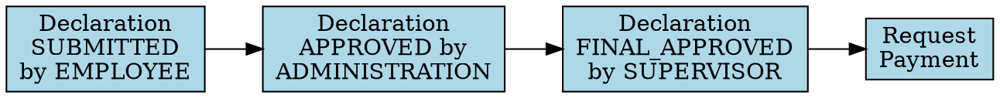

### 1.2 Resource Dependencies

Resource dependencies occur when specific resources (roles) are required to perform certain activities.

**Examples:**
- EMPLOYEE role is required for declaration submission
- ADMINISTRATION role is required for administrative approval
- SUPERVISOR role is required for final approval

**Graphical Representation:**
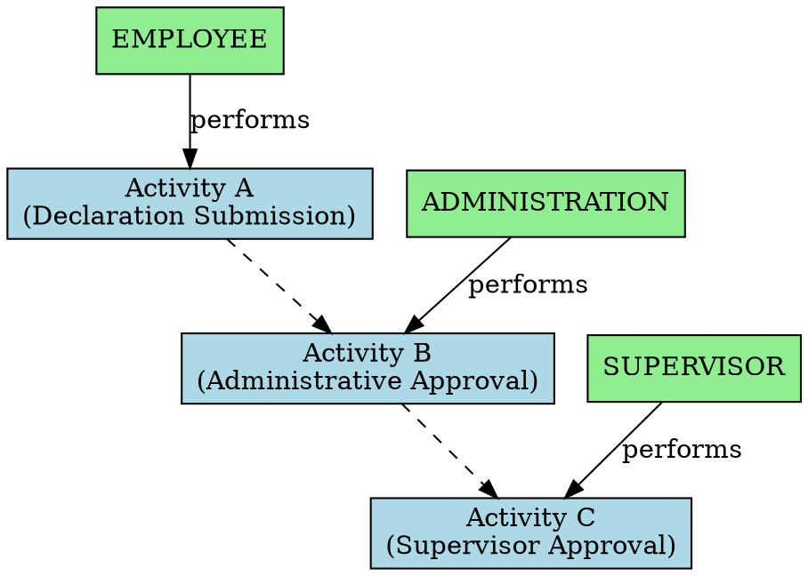

### 1.3 Data Dependencies

Data dependencies exist when activities require specific information to proceed.

**Examples:**
- Declaration amount influences approval routing
- Budget number is required for budget owner approval
- Declaration details are required for all approval activities

**Graphical Representation:**
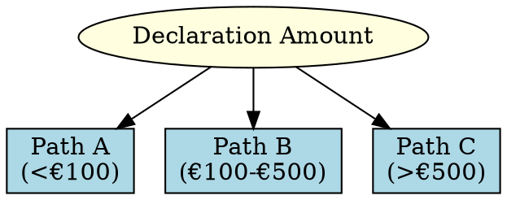

### 1.4 Temporal Dependencies

Temporal dependencies represent timing constraints on activities.

**Examples:**
- Payment activities typically occur within 2 days of request
- Rejections typically lead to resubmission within 3 days
- Administrative approval typically occurs within 1 day of submission

**Graphical Representation:**
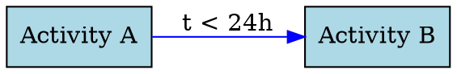

## 2. Information Flow in the Process

### 2.1 Core Information Elements

The declaration process involves several key information elements:

1. **Declaration Details** (case:id, case:concept:name)
   - Created during submission
   - Referenced throughout the entire process
   - Unchanging through the process

2. **Declaration Amount** (case:Amount)
   - Entered during submission
   - Used for routing decisions
   - Influences approval requirements

3. **Budget Reference** (case:BudgetNumber)
   - Associated with the declaration
   - Used for budget owner routing
   - Links declaration to budget accountability

4. **Timestamps** (time:timestamp)
   - Created at each activity
   - Used for monitoring and performance tracking

5. **User/Role Information** (org:resource, org:role)
   - Captures who performed each activity
   - Enforces authorization rules

### 2.2 Information Flow Graph

The information flow through the process can be represented as a directed graph:

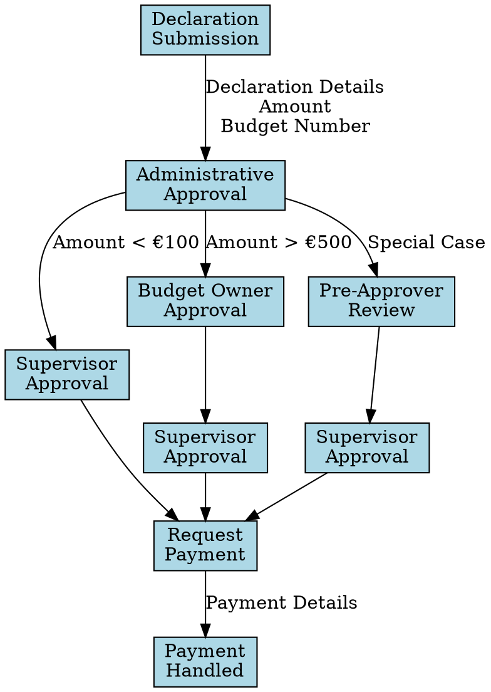

## 3. Constraints in the Declaration Process

### 3.1 Approval Authority Constraints

The process enforces constraints on who can approve declarations:

1. **Amount-Based Approval Constraints**
   - Declarations < €100: Supervisor approval sufficient
   - Declarations €100-€500: Administration + Supervisor approval
   - Declarations > €500: Additional Budget Owner approval required
   - Declarations > €1000: May require Pre-Approver involvement

2. **Role-Based Authorization Constraints**
   - Only SUPERVISOR role can provide final approval
   - Only BUDGET OWNER role can provide budget approval
   - Only ADMINISTRATION role can provide administrative approval

**Constraint Graph:**
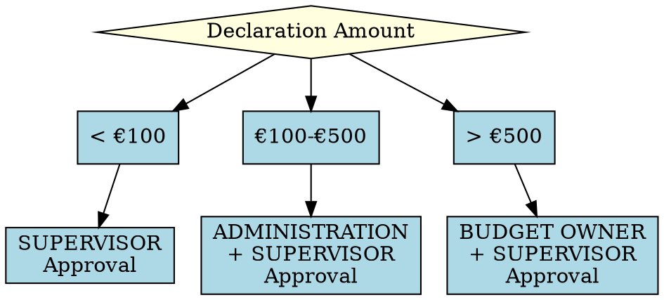

### 3.2 Process Path Constraints

Certain constraints govern the valid paths through the process:

1. **Mandatory Activities**
   - All declarations must be submitted by an employee
   - All declarations must have administrative review
   - All approved declarations must result in payment request

2. **Conditional Activities**
   - Budget owner approval only if declaration meets criteria
   - Pre-approver review only for special case declarations

3. **Terminal Activities**
   - Process can end with payment handled (success path)
   - Process can end with employee rejection (abandonment path)

**Path Constraint Graph:**
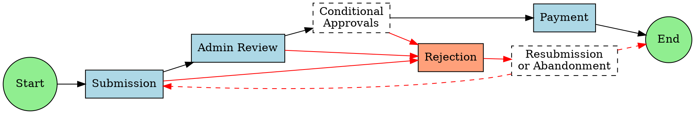

### 3.3 Temporal Constraints

Time-based constraints affect the process flow:

1. **Service Level Agreements (SLAs)**
   - Administrative review: expected within 24 hours
   - Supervisor approval: expected within 48 hours
   - Budget owner approval: expected within 72 hours
   - Payment processing: expected within 48 hours

2. **Processing Windows**
   - Activities primarily occur during business hours
   - Payments processed in batches at specific times
   - Reduced processing during holiday periods

**Temporal Constraint Graph:**
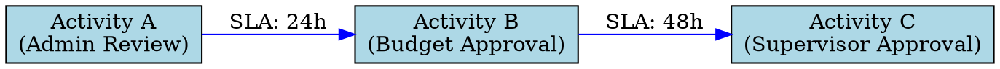

## 4. Influence Propagation in the Process

### 4.1 Direct Influences

Direct influences represent immediate effects of one aspect on another:

1. **Amount → Approval Path**
   - Higher amounts require more approvals
   - Amount directly influences routing decisions

2. **Role → Activity Authorization**
   - Roles directly determine who can perform activities
   - Role hierarchies influence approval capabilities

3. **Rejection → Process Loop**
   - Rejections directly cause return to earlier stages
   - Rejection reason influences resubmission content

**Direct Influence Graph:**
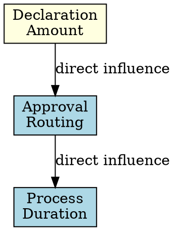

### 4.2 Indirect Influences

Indirect influences represent cascading effects through multiple steps:

1. **Amount → Processing Time**
   - Higher amounts require more approvals
   - More approvals lead to longer processing times
   - Therefore, amount indirectly influences total duration

2. **Submission Quality → Success Rate**
   - Better submissions have lower rejection rates
   - Lower rejection rates mean fewer loops
   - Therefore, submission quality indirectly influences success rate

3. **Seasonal Factors → Processing Delays**
   - Holiday periods have fewer active approvers
   - Fewer approvers lead to longer waiting times
   - Therefore, seasonal factors indirectly influence processing times

**Indirect Influence Graph:**
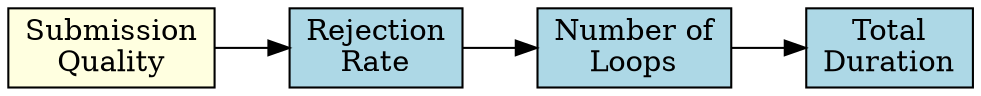

### 4.3 Feedback Loops

The process contains several feedback loops where influences cycle back:

1. **Rejection → Resubmission → Re-evaluation**
   - Rejections lead to resubmissions
   - Resubmissions require new evaluations
   - New evaluations may lead to further rejections

2. **Process Duration → Escalation → Priority → Process Duration**
   - Long-running cases may trigger escalation
   - Escalation increases priority
   - Higher priority reduces further waiting times

**Feedback Loop Graph:**
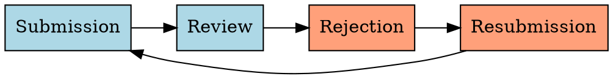

## 5. Graph Structures of Dependencies

The dependencies, constraints, and influences in the declaration process form several distinct graph structures:

### 5.1 Process Dependency Graph

The overall process dependency graph combines all sequential dependencies:

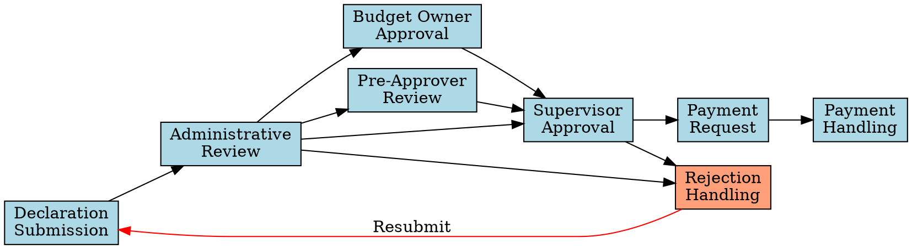

This graph shows the complete process flow with all possible paths and dependencies.

### 5.2 Information Dependency Graph

The information dependency graph shows how data elements are created, used, and transformed:

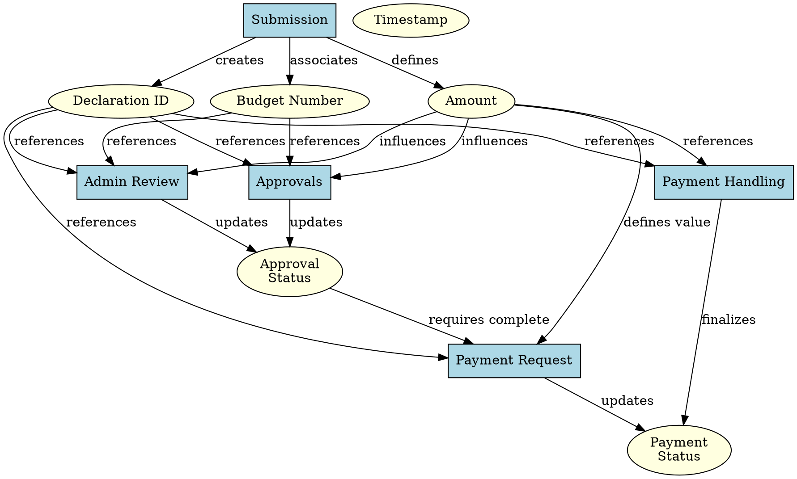

This graph shows how information elements are related to activities and how they influence each other.

### 5.3 Constraint Propagation Graph

The constraint propagation graph shows how constraints flow through the process:

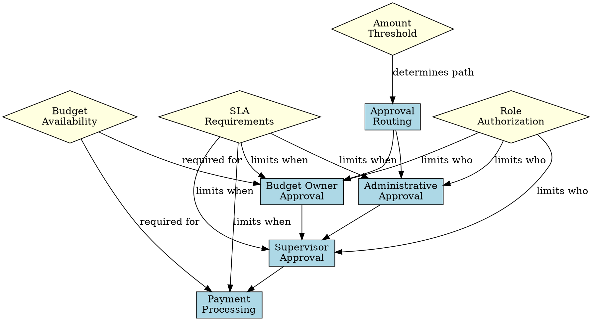

This graph demonstrates how various constraints influence and propagate through different stages of the process.

### 5.4 Influence Network

The influence network shows causal relationships between factors affecting the process:

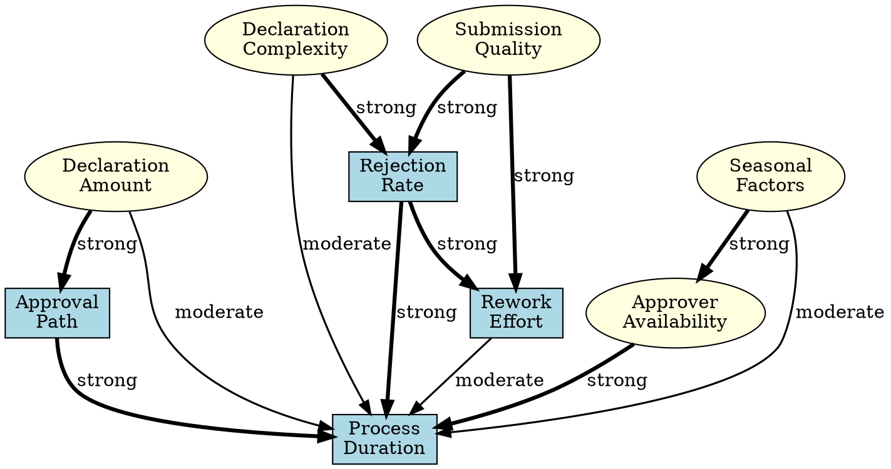

This network shows how different factors influence process performance metrics, with edge weights indicating influence strength.

## 6. Selective Focus in Task Dependencies

Different aspects of task dependencies have varying importance in different contexts, requiring selective focus. Here are key examples from the declarations process:

### 6.1 Operational Focus

For day-to-day operations, the focus is on sequential dependencies and current workload:

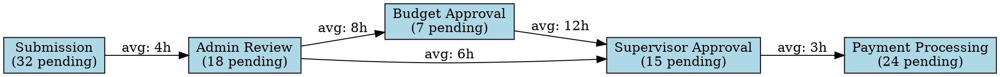

This operational view focuses on workload at each stage and average waiting times.

### 6.2 Performance Improvement Focus

When focusing on process improvement, bottlenecks and time constraints become more important:

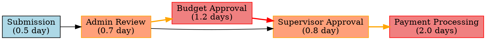

This performance view highlights bottlenecks and stages with longest processing times.

### 6.3 Resource Allocation Focus

When focusing on resource allocation, resource dependencies become more important:

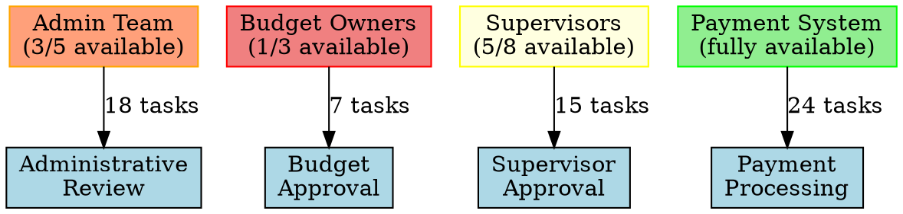

This resource view shows staffing levels and workload distribution.

### 6.4 Compliance Focus

When focusing on compliance, authorization constraints become more important:

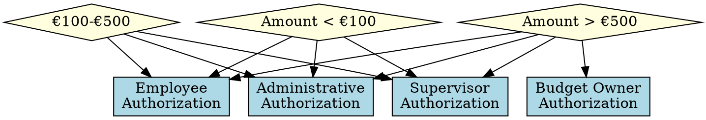

This compliance view emphasizes authorization requirements for different scenarios.

### 6.5 Exception Handling Focus

When dealing with exceptions, rejection paths and feedback loops become more important:

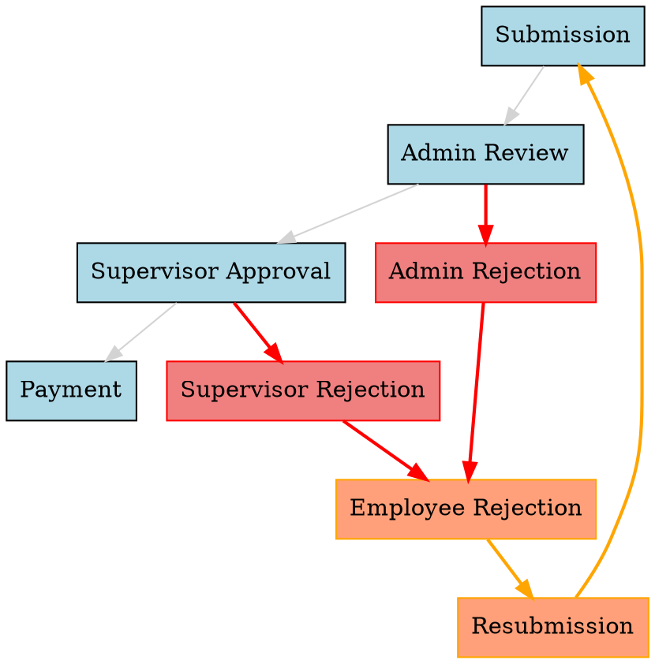

This exception view highlights rejection paths and resubmission loops.

## 7. Applications of Dependency Graphs

The various dependency graph structures have several applications in process analysis and improvement:

### 7.1 Bottleneck Identification

By analyzing the process dependency graph along with timing data, bottlenecks can be identified:

```graphviz
digraph BottleneckIdentification {
    rankdir=LR;
    node [shape=box, style=filled, fillcolor=lightblue];
    
    submit [label="Submission\n(0.5 day)"];
    admin [label="Admin Review\n(0.7 day)"];
    budget [label="Budget Owner\n(1.2 days)", color=red, fillcolor=lightcoral];
    super [label="Supervisor\n(0.8 day)"];
    payment [label="Payment\n(2.0 days)", color=red, fillcolor=lightcoral];
    end [shape=circle];
    
    submit -> admin;
    admin -> budget [label="10.5h wait", color=orange];
    budget -> super [label="22.5h wait", color=red];
    admin -> super [label="9.2h wait"];
    super -> payment [label="5.7h wait"];
    payment -> end [label="48.1h wait", color=red];
}
```

This shows that budget owner approval and payment processing are the main bottlenecks.

### 7.2 Critical Path Analysis

The dependency graph can reveal the critical path through the process:

```graphviz
digraph CriticalPath {
    rankdir=LR;
    node [shape=box, style=filled, fillcolor=lightblue];
    
    submit [label="Submission\n(0.5 day)"];
    admin [label="Admin Review\n(0.7 day)"];
    budget [label="Budget Owner\n(1.2 days)"];
    super [label="Supervisor\n(0.8 day)"];
    payment [label="Payment\n(2.0 days)"];
    end [shape=circle];
    
    submit -> admin;
    admin -> budget [style=bold, color=red];
    budget -> super [style=bold, color=red];
    admin -> super;
    super -> payment [style=bold, color=red];
    payment -> end [style=bold, color=red];
    
    {rank=same; submit admin budget super payment end}
    
    label = "Critical Path (Total: 5.2 days)";
    labelloc = "t";
}
```

This shows the longest path through the process, which determines the minimum possible processing time.

### 7.3 Resource Optimization

Dependency graphs help optimize resource allocation:

```graphviz
digraph ResourceOptimization {
    node [shape=box, style=filled, fillcolor=lightblue];
    
    // Resources
    admin_res [label="Admin\nResources"];
    budget_res [label="Budget Owner\nResources"];
    super_res [label="Supervisor\nResources"];
    
    // Activities
    admin_act [label="Admin\nReview\n(18 tasks)"];
    budget_act [label="Budget\nApproval\n(7 tasks)"];
    super_act [label="Supervisor\nApproval\n(15 tasks)"];
    
    // Current allocation
    admin_res -> admin_act [label="3 staff\n(6 tasks/staff)"];
    budget_res -> budget_act [label="1 staff\n(7 tasks/staff)", color=red];
    super_res -> super_act [label="5 staff\n(3 tasks/staff)", color=green];
    
    // Suggested reallocation
    edge [style=dashed];
    super_res -> budget_act [label="Delegate 1\nsupervisor", color=blue];
}
```

This shows resource imbalances and suggests potential reallocation.

### 7.4 Process Simplification

Dependency analysis can identify simplification opportunities:

```graphviz
digraph ProcessSimplification {
    rankdir=LR;
    node [shape=box, style=filled, fillcolor=lightblue];
    
    // Current process
    subgraph cluster_current {
        label = "Current Process";
        c_submit [label="Submission"];
        c_admin [label="Admin Review"];
        c_budget [label="Budget Approval"];
        c_super [label="Supervisor Approval"];
        c_payment [label="Payment"];
        
        c_submit -> c_admin;
        c_admin -> c_budget;
        c_budget -> c_super;
        c_super -> c_payment;
    }
    
    // Simplified process
    subgraph cluster_simplified {
        label = "Simplified Process";
        s_submit [label="Submission"];
        s_auto [label="Automated\nVerification", color=green, fillcolor=lightgreen];
        s_approval [label="Combined\nApproval", color=green, fillcolor=lightgreen];
        s_payment [label="Payment"];
        
        s_submit -> s_auto;
        s_auto -> s_approval;
        s_approval -> s_payment;
    }
}
```

This compares the current process with a simplified alternative.

## Conclusion

The BPI2020 Domestic Declarations process exhibits a complex network of dependencies, constraints, and influences that determine how declarations flow through the organization. These dependencies form various graph structures that can be analyzed to understand process behavior, identify bottlenecks, and target improvements.

By selectively focusing on different aspects of these dependencies—sequential, resource, data, or temporal—analysts can gain insights that address specific process challenges. The graphs presented in this document provide multiple perspectives on the declaration process, revealing its underlying structure and dynamics.

These dependency analyses form the foundation for process optimization, resource allocation, and improvement initiatives. By understanding how activities depend on each other and how information, constraints, and influences propagate through the process, organizations can make targeted changes that enhance efficiency, reduce processing times, and improve overall process performance.