# Task Dependencies with Varying Importance in Different Contexts

## Overview

Within the BPI2020 Domestic Declarations process, task dependencies exhibit varying levels of importance depending on the context and perspective from which the process is viewed. This document explores how different aspects of task dependencies require selective focus in various situations, and illustrates this with specific examples from the declarations process.

## 1. Contextual Importance of Dependencies

Task dependencies in business processes don't have uniform importance across all contexts. Their significance varies based on:

1. **Organizational Objective** (operational efficiency, compliance, cost reduction)
2. **Stakeholder Perspective** (employee, manager, auditor, finance department)
3. **Time Horizon** (daily operations, monthly planning, strategic improvement)
4. **Process State** (normal operation, exception handling, peak load)
5. **External Factors** (regulatory changes, seasonal patterns, resource availability)

The BPI2020 Domestic Declarations process clearly demonstrates this varying importance through multiple examples.

## 2. Selective Focus for Different Organizational Roles

### 2.1 Employee Perspective

For employees submitting declarations, certain dependencies have heightened importance:

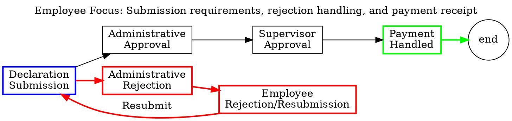

**Key Dependencies for Employees:**
- Submission → Administrative Approval/Rejection (will my submission be accepted?)
- Administrative Rejection → Resubmission requirements (what must I fix?)
- Final Approval → Payment (when will I be reimbursed?)

**Less Important Dependencies:**
- Specific approval routing (which manager approves?)
- Internal system processes (how is payment processed?)

### 2.2 Manager Perspective

For supervisors and budget owners approving declarations, different dependencies become critical:

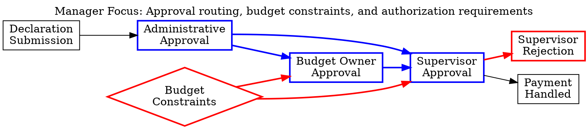

**Key Dependencies for Managers:**
- Administrative Approval → Budget/Supervisor Approval (proper routing)
- Budget Constraints → Approval Decisions (budget availability)
- Budget Owner Approval → Supervisor Approval (proper sequencing)
- Amount Thresholds → Approval Requirements (authorization levels)

**Less Important Dependencies:**
- Initial submission details (already vetted by administration)
- Payment execution details (handled by system)

### 2.3 Finance Department Perspective

For the finance department processing payments, another set of dependencies becomes primary:

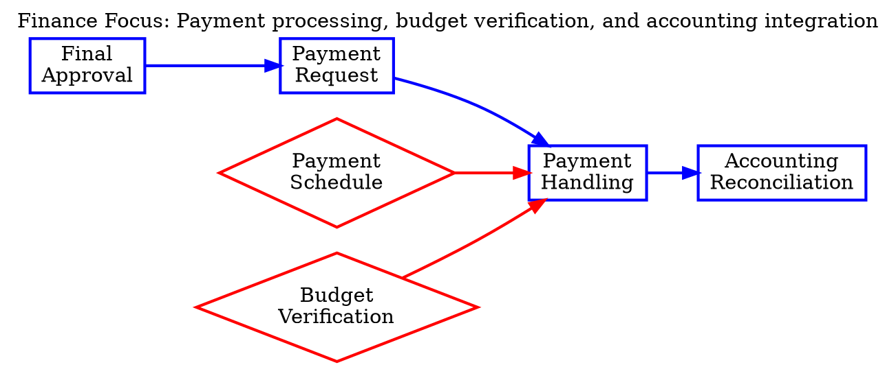

**Key Dependencies for Finance:**
- Final Approval → Payment Request (authorization complete)
- Payment Request → Payment Handling (proper documentation)
- Payment Handling → Accounting Reconciliation (financial records)
- Payment Schedule → Payment Execution (batch processing)

**Less Important Dependencies:**
- Specific approval routing (already completed)
- Rejection handling (not finance responsibility)

## 3. Time Horizon Perspectives

The importance of dependencies also shifts depending on the time horizon under consideration.

### 3.1 Daily Operational Focus

For day-to-day operations, immediate tactical dependencies dominate:

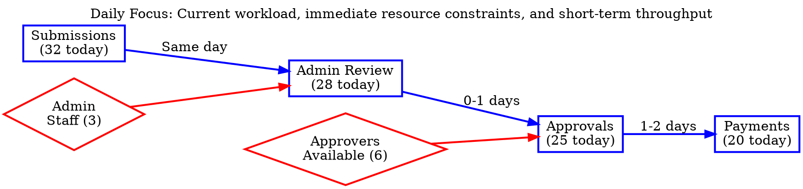

**Key Dependencies for Daily Operations:**
- Current submissions → Administrative capacity (today's workload)
- Today's approvals → Tomorrow's payment requests (short workflow)
- Available resources → Activity completion (immediate throughput)

**Less Important Dependencies:**
- Long-term process patterns (not immediately actionable)
- Historical performance trends (background context)

### 3.2 Monthly Management Focus

For monthly management review, medium-term dependencies and patterns become more relevant:

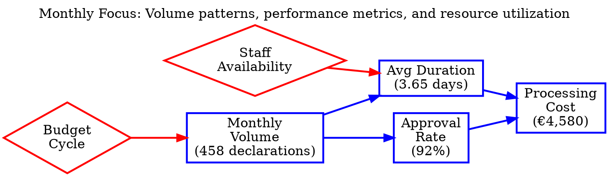

**Key Dependencies for Monthly Management:**
- Declaration volume → Approval rates (workload impact)
- Approval patterns → Process duration (efficiency measure)
- Process duration → Processing cost (resource efficiency)
- Monthly cycles → Declaration volume (predictable patterns)

**Less Important Dependencies:**
- Individual case details (too granular)
- Day-to-day variations (noise rather than signal)

### 3.3 Strategic Improvement Focus

For strategic process improvement, long-term structural dependencies gain importance:

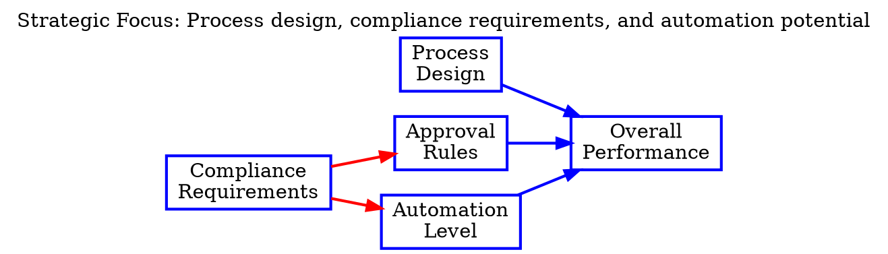

**Key Dependencies for Strategic Improvement:**
- Process design → Overall performance (fundamental structure)
- Approval rules → Process efficiency (policy constraints)
- Automation level → Resource requirements (technology leverage)
- Compliance requirements → Process constraints (regulatory boundaries)

**Less Important Dependencies:**
- Individual resource allocation (tactical detail)
- Day-to-day performance variations (short-term noise)

## 4. Process State Perspectives

The process state dramatically changes which dependencies are most critical.

### 4.1 Normal Operation State

During normal operations, standard flow dependencies dominate:

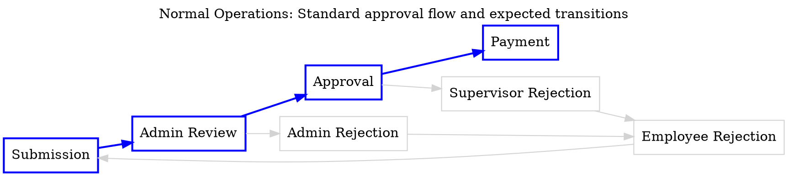

**Key Dependencies in Normal Operations:**
- Submission → Admin Review (standard initiation)
- Admin Review → Approval (expected progression)
- Approval → Payment (successful completion)
- Sequential transitions (orderly flow)

**Less Important Dependencies:**
- Exception handling paths (rare occurrences)
- Resubmission loops (unusual cases)

### 4.2 Exception Handling State

When dealing with exceptions, rejection and rework dependencies become critical:

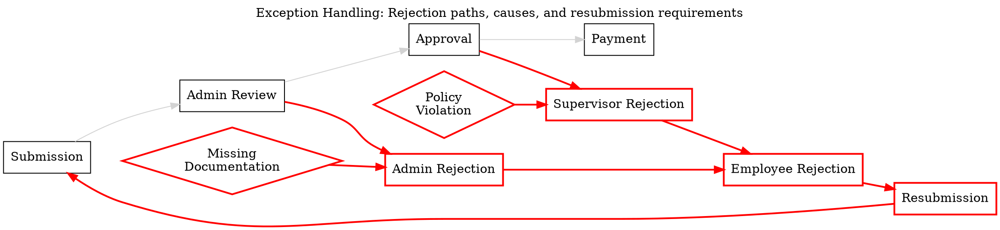

**Key Dependencies in Exception Handling:**
- Administrative Review → Rejection (problem identification)
- Rejection → Rejection Reason (correction guidance)
- Rejection → Employee Notification (communication)
- Resubmission → Submission (rework cycle)

**Less Important Dependencies:**
- Standard approval flow (temporarily irrelevant)
- Payment processing (not yet applicable)

### 4.3 Peak Load State

During peak load periods, resource constraints and bottlenecks become the critical dependencies:

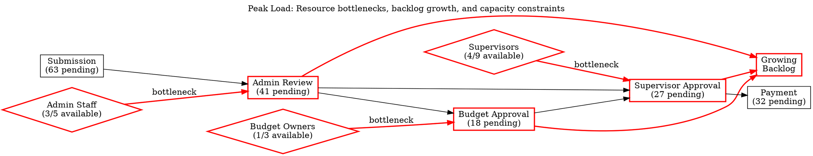

**Key Dependencies During Peak Load:**
- Resource availability → Activity completion (throughput constraint)
- Process bottlenecks → Backlog growth (queue management)
- Workload balancing → Process flow (resource optimization)
- Prioritization rules → Processing sequence (backlog management)

**Less Important Dependencies:**
- Detailed process rules (overwhelmed by volume)
- Exception handling details (secondary to throughput)

## 5. Stakeholder Perspective Dependencies

Different stakeholders focus on different aspects of process dependencies.

### 5.1 Process Participant View

Process participants (employees, approvers) focus on activity-level dependencies:

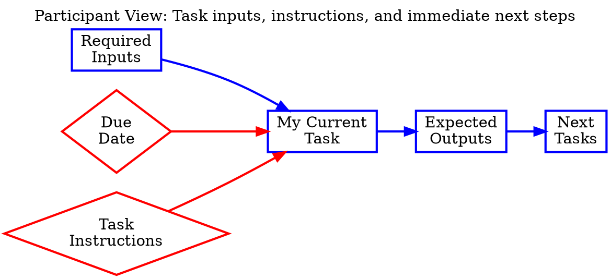

**Key Dependencies for Participants:**
- Required inputs → My task (what I need)
- My task → Expected outputs (what I produce)
- Task instructions → Correct execution (how to do it)
- Due date → Task priority (when it's needed)

**Less Important Dependencies:**
- Overall process structure (bigger picture)
- Upstream process history (prior activities)
- Downstream consequences (future handling)

### 5.2 Process Owner View

Process owners focus on end-to-end flow and performance dependencies:

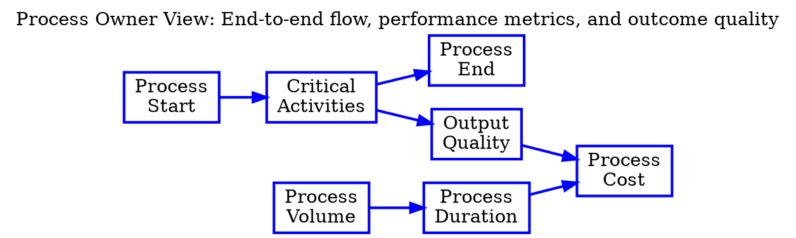

**Key Dependencies for Process Owners:**
- Process start → Process end (complete execution)
- Critical activities → Process outputs (value delivery)
- Process volume → Resource requirements (capacity planning)
- Process duration → Process cost (efficiency)
- Output quality → Process success (effectiveness)

**Less Important Dependencies:**
- Individual task details (too granular)
- Specific resource assignments (delegation detail)

### 5.3 Auditor View

Auditors focus on compliance and control dependencies:

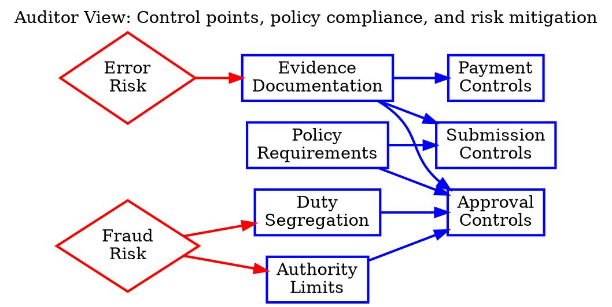

**Key Dependencies for Auditors:**
- Policy requirements → Control implementation (compliance)
- Role segregation → Approval controls (fraud prevention)
- Authority limits → Approval levels (authorization control)
- Evidence documentation → Process verification (audit trail)
- Control effectiveness → Risk mitigation (risk management)

**Less Important Dependencies:**
- Process efficiency (secondary to control)
- Resource optimization (outside audit scope)

## 6. Specific BPI2020 Declaration Process Examples

### 6.1 Amount-Based Approval Routing

The declaration amount creates critical dependencies for routing approvals:

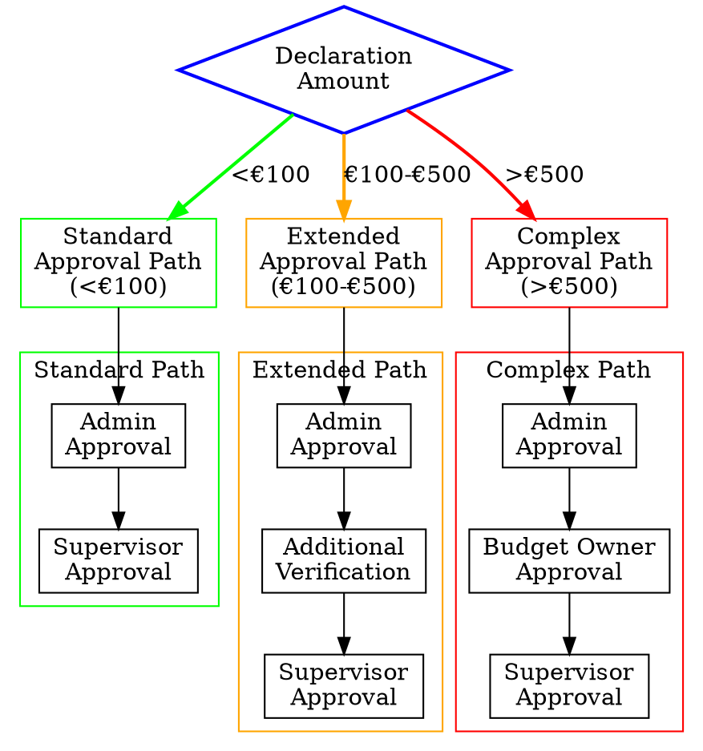

In this example, declaration amount creates critical routing dependencies that determine the entire approval path. This dependency has highest importance during the administrative review stage, but becomes less important once the declaration is routed to the appropriate path.

### 6.2 Budget Owner Availability Impact

The availability of budget owners creates a critical dependency during peak periods:

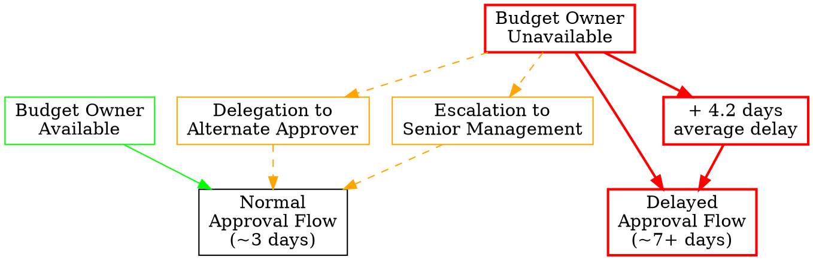

This dependency becomes critical during vacation periods or times when budget owners are unavailable, causing significant delays. However, during normal operations when budget owners are available, this dependency has minimal impact.

### 6.3 Rejection-Resubmission Cycle

The rejection-resubmission cycle creates a feedback loop dependency that significantly impacts process duration:

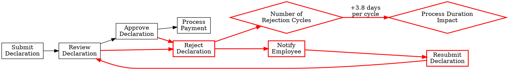

This dependency becomes dominant for cases experiencing rejection, adding significant duration to the process. For cases that proceed without rejection, this entire dependency structure can be ignored.

### 6.4 Payment Schedule Constraints

Payment processing depends critically on payment scheduling constraints:

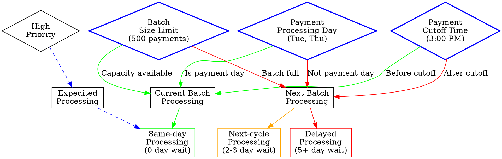

This dependency becomes critical at payment processing time but is irrelevant during earlier approval stages. The importance also varies by day of the week, with heightened importance near payment processing days and cutoff times.

## 7. Application Areas for Selective Dependency Focus

Understanding which dependencies matter most in different contexts has several practical applications:

### 7.1 Process Monitoring Dashboards

Different dashboards can be created for different stakeholders, focusing on the dependencies most relevant to them:

1. **Employee Dashboard**: Submission status, rejection reasons, payment timing
2. **Manager Dashboard**: Pending approvals, budget impacts, approval timing
3. **Finance Dashboard**: Payment batches, processing schedule, reconciliation status
4. **Executive Dashboard**: Process volume, duration trends, cost metrics

### 7.2 Process Improvement Initiatives

Improvement efforts can target different dependencies based on organizational priorities:

1. **Efficiency Focus**: Target sequential dependencies and approval paths
2. **Compliance Focus**: Enhance control dependencies and authorization rules
3. **Cost Reduction Focus**: Optimize resource dependencies and automation
4. **User Experience Focus**: Improve information dependencies and communication

### 7.3 Resource Allocation Decisions

Resource allocation can prioritize the most critical dependencies based on current needs:

1. **Normal Operations**: Balance resources across standard activities
2. **Peak Periods**: Allocate additional resources to bottleneck activities
3. **Exception Handling**: Dedicate resources to rejection handling and resubmission
4. **Process Changes**: Focus resources on training and transition management

### 7.4 Risk Management Strategies

Risk mitigation can focus on dependencies with the highest potential impact:

1. **Operational Risks**: Monitor resource dependencies and bottlenecks
2. **Compliance Risks**: Strengthen authorization dependencies and controls
3. **Financial Risks**: Enhance budget verification and payment processing dependencies
4. **Reputational Risks**: Improve communication dependencies and transparency

## Conclusion

The BPI2020 Domestic Declarations process clearly demonstrates how task dependencies vary in importance across different contexts, stakeholders, time horizons, and process states. By applying selective focus to the most relevant dependencies in each situation, organizations can more effectively manage, monitor, and improve their processes.

Key insights from this analysis include:

1. **Contextual Relevance**: Dependencies that are critical in one context may be peripheral in another
2. **Stakeholder Perspectives**: Different roles naturally focus on different aspects of the process
3. **Temporal Variation**: The importance of dependencies shifts over time and at different process stages
4. **State-Based Priorities**: Normal operations, exceptions, and peak loads each have different critical dependencies
5. **Selective Focus Benefits**: Focusing on the right dependencies for each situation improves decision-making and process management

By understanding and applying selective focus to task dependencies, organizations can develop more nuanced, effective approaches to process management and improvement, ultimately leading to better outcomes for all stakeholders involved in the declaration process.