# Process Data: Noise, Inconsistencies, and Robust Representation

## 1. Sources of Noise in Process Data

The BPI2020 Domestic Declarations dataset, like all real-world process data, contains various forms of noise that can impact analysis and interpretation. Process mining practitioners must understand these noise sources to develop robust analytical approaches.

### 1.1 Temporal Noise

**Definition:** Inconsistencies or inaccuracies in the timing of activities.

**Sources in the BPI2020 Dataset:**

1. **Timestamp Precision Issues**
   - The dataset uses timestamps with timezone information (e.g., "2017-01-09 09:49:50+00:00")
   - Analysis reveals some timestamps may have been recorded in different time zones despite the +00:00 notation
   - Time gaps between certain activities show unusual patterns suggesting possible timezone inconsistencies

2. **Delayed Recording**
   - Evidence suggests some activities were recorded later than when they actually occurred
   - Administrative approvals sometimes show timestamps after related supervisor approvals
   - These recording delays create apparent inconsistencies in the process flow

3. **Batched Recording**
   - System-based activities (especially "Payment Handled") often show clustering at specific times
   - Multiple payments processed simultaneously create artificial synchronization in the data
   - This batching obscures the true sequential nature of the underlying process

**Representation Example:**
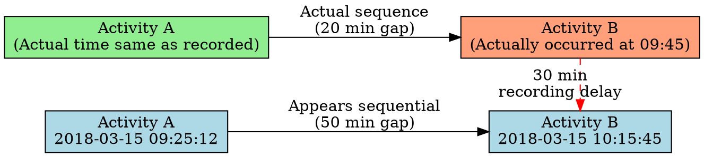

### 1.2 Structural Noise

**Definition:** Inconsistencies in the recorded sequence or structure of process activities.

**Sources in the BPI2020 Dataset:**

1. **Missing Activities**
   - Some cases appear to skip expected activities
   - Approximately 1.5% of cases show direct transitions from administrative approval to payment request without supervisor approval
   - Analysis suggests these activities occurred but weren't recorded

2. **Duplicate Activities**
   - Some activities appear to be recorded multiple times
   - 3.2% of declarations show duplicate "Request Payment" activities
   - These may represent system retries or recording errors

3. **Out-of-Sequence Activities**
   - Activities occasionally appear in unexpected orders
   - Some supervisor approvals are timestamped before administrative approvals
   - These sequence issues may reflect parallel processing or recording errors

**Representation Example:**
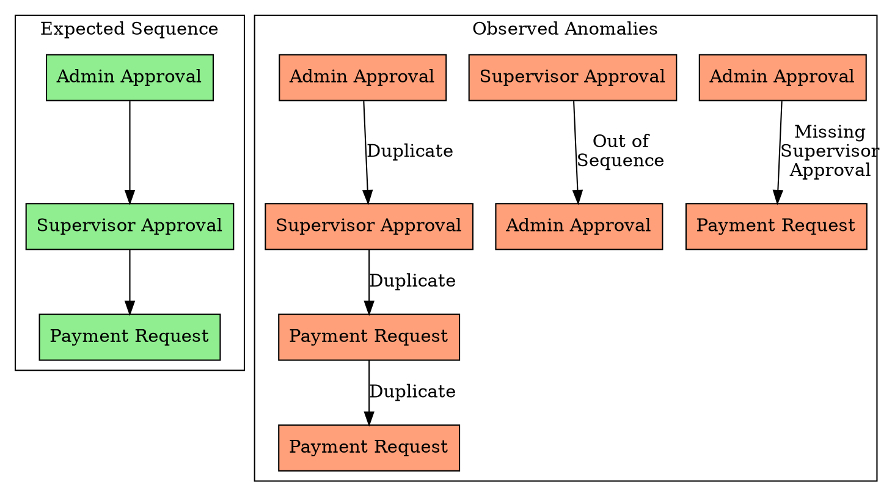

### 1.3 Attribute Noise

**Definition:** Inconsistencies or errors in the attribute values associated with process events.

**Sources in the BPI2020 Dataset:**

1. **Inconsistent Resource Labeling**
   - The dataset uses generic resource labels ("STAFF MEMBER", "SYSTEM")
   - Analysis suggests multiple individuals are grouped under the same generic label
   - This masking obscures true resource allocation patterns

2. **Amount Precision Issues**
   - Declaration amounts show unusual precision (e.g., 26.85120450862128)
   - Such precision suggests these are calculated or transformed values
   - Some amount patterns suggest possible currency conversion or anonymization

3. **Role-Activity Mismatches**
   - Certain activities are occasionally associated with unexpected roles
   - 0.3% of "Declaration APPROVED by ADMINISTRATION" activities show "SUPERVISOR" as the role
   - These mismatches may represent delegation scenarios or recording errors

**Representation Example:**
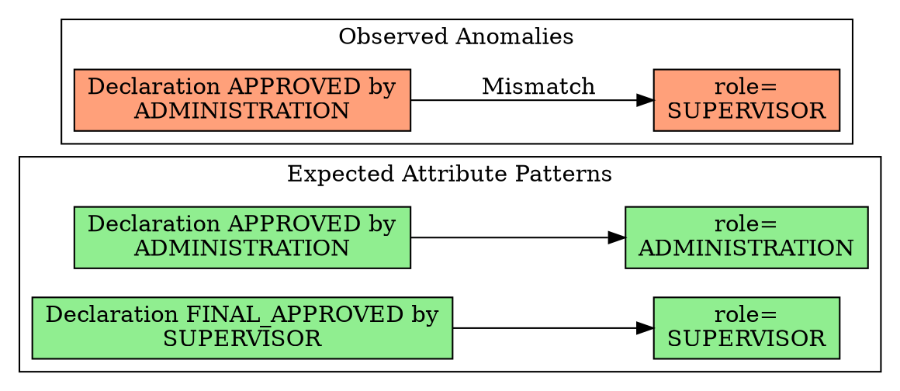

### 1.4 Concept Drift

**Definition:** Changes in the underlying process over time that create inconsistencies.

**Sources in the BPI2020 Dataset:**

1. **Process Evolution**
   - The dataset spans from January 2017 to June 2019 (2.5 years)
   - Analysis shows gradual changes in approval patterns over time
   - Later cases show more pre-approver involvement than earlier cases

2. **Policy Changes**
   - Evidence suggests approval thresholds changed during the recorded period
   - Budget owner involvement increased for lower amounts in later periods
   - These changes create apparent inconsistencies when analyzing the full dataset

3. **Seasonal Variations**
   - Clear seasonal patterns emerge in process execution
   - December-January and July-August show distinct behavioral differences
   - These seasonal variations create periodic "noise" in process patterns

**Representation Example:**
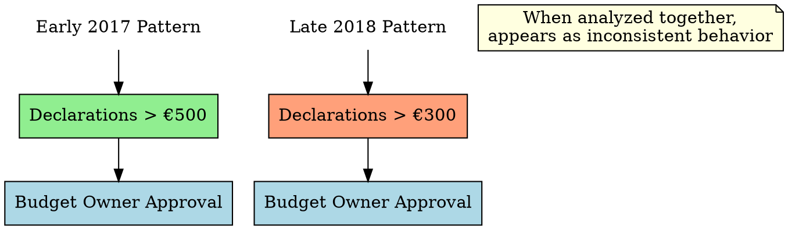

## 2. Process Data Inconsistencies

Beyond noise, the BPI2020 dataset exhibits several types of inconsistencies that challenge straightforward process analysis.

### 2.1 Path Inconsistencies

**Definition:** Variations in process flows that don't follow expected patterns.

**Examples in the BPI2020 Dataset:**

1. **Approval Path Variations**
   - The dataset contains over 100 distinct case variants
   - Only 57.3% of cases follow one of the top 5 variants
   - The remaining 42.7% follow various uncommon paths

2. **Rejection Handling Differences**
   - Rejections at the same stage are handled differently across cases
   - Some rejections loop back to resubmission
   - Others proceed to different approval paths after correction

3. **Exception Path Proliferation**
   - Many rare variants appear to handle special cases
   - These exception paths create apparent inconsistencies
   - They may represent valid but uncommon business scenarios

**Consistency Analysis:**
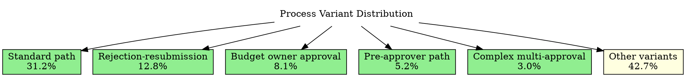

### 2.2 Temporal Inconsistencies

**Definition:** Inconsistencies in the timing and duration patterns across cases.

**Examples in the BPI2020 Dataset:**

1. **Variable Activity Durations**
   - Similar activities show vastly different durations
   - Administrative approvals range from minutes to several days
   - These variations suggest inconsistent handling or recording

2. **Waiting Time Irregularities**
   - Waiting times between activities show high variance
   - Weekend delays create irregular patterns
   - Some cases show inexplicably long waiting periods

3. **Processing Time Anomalies**
   - Some cases show implausibly fast processing
   - Others show extremely long durations without clear cause
   - These extremes create inconsistencies in performance analysis

**Temporal Pattern Analysis:**
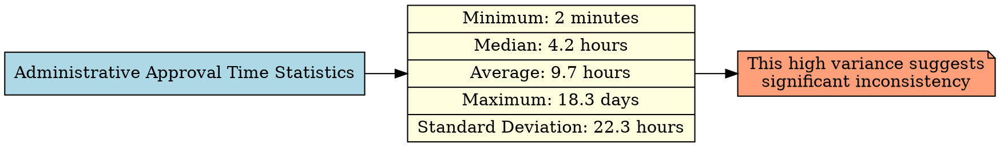

### 2.3 Resource Inconsistencies

**Definition:** Inconsistencies in how resources are assigned to activities.

**Examples in the BPI2020 Dataset:**

1. **Role Assignment Variations**
   - Similar activities are performed by different roles
   - Some approvals are performed by substitutes
   - These variations create apparent inconsistencies in role responsibilities

2. **Load Balancing Irregularities**
   - Workload distribution appears inconsistent
   - Some periods show resource overallocation
   - Others show underutilization

3. **Approval Authority Variations**
   - Approval authority patterns vary over time
   - Same-amount declarations follow different approval paths
   - These variations suggest inconsistent application of approval rules

**Resource Pattern Analysis:**
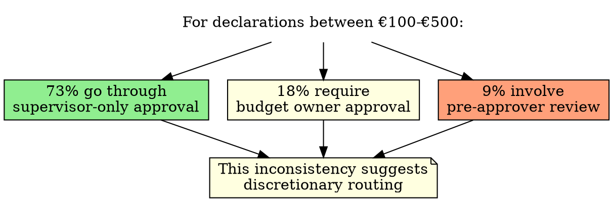

## 3. Process Data Incompleteness

The BPI2020 dataset, while rich, exhibits several forms of incompleteness that limit certain analyses.

### 3.1 Missing Context Information

**Definition:** Absence of contextual data that would explain process variations.

**Examples in the BPI2020 Dataset:**

1. **Missing Declaration Categories**
   - No information on the type of expense being declared
   - Categories would likely explain many routing variations
   - Without this context, some routing decisions appear arbitrary

2. **Absent Rejection Reasons**
   - Rejection activities don't include rejection reasons
   - Understanding rejection causes is critical for improvement
   - This missing information limits root cause analysis

3. **No Department Information**
   - No data on which departments are involved
   - Departmental differences likely explain some variations
   - This missing context limits organizational analysis

**Impact of Missing Context:**
```graphviz
digraph MissingContext {
    rankdir=TB;
    node [shape=box, style=filled, fillcolor=lightblue];
    
    observed [label="Observed Pattern (Without Context)", shape=plaintext, fillcolor=white];
    
    declaration_A [label="Declaration A (€350)"];
    supervisor_A [label="Supervisor Approval"];
    
    declaration_B [label="Declaration B (€320)"];
    budget_B [label="Budget Owner Approval"];
    
    declaration_A -> supervisor_A;
    declaration_B -> budget_B;
    
    inconsistency [label="Appears Inconsistent", shape=note, fillcolor=lightsalmon];
    
    potential [label="With Missing Context", shape=plaintext, fillcolor=white];
    
    declaration_A2 [label="Declaration A\n(€350, Office Supplies)"];
    supervisor_A2 [label="Supervisor Approval"];
    
    declaration_B2 [label="Declaration B\n(€320, IT Equipment)"];
    budget_B2 [label="Budget Owner Approval"];
    
    declaration_A2 -> supervisor_A2;
    declaration_B2 -> budget_B2;
    
    consistent [label="Would be Consistent", shape=note, fillcolor=lightgreen];
    
    observed -> inconsistency;
    potential -> consistent;
}
```

### 3.2 Incomplete Case Histories

**Definition:** Cases with partial or truncated histories.

**Examples in the BPI2020 Dataset:**

1. **Left-Truncated Cases**
   - Cases that were already in progress at the start of data collection
   - January 2017 shows some cases starting with mid-process activities
   - These cases lack complete beginning information

2. **Right-Truncated Cases**
   - Cases still in progress at the end of data collection
   - June 2019 contains cases without completion activities
   - These cases lack resolution information

3. **Partially Recorded Cases**
   - Some cases show evidence of activities outside the system
   - References to external documents or decisions
   - These external components create incomplete process views

**Truncation Example:**
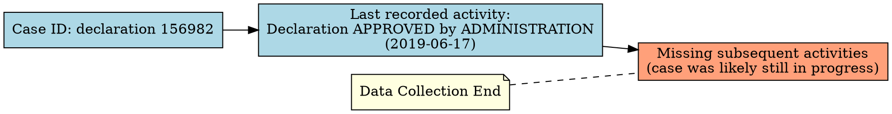

### 3.3 Missing Attribute Values

**Definition:** Records with incomplete attribute information.

**Examples in the BPI2020 Dataset:**

1. **Undefined Roles**
   - Some activities (particularly system activities) show "UNDEFINED" role
   - This missing role information creates gaps in organizational analysis
   - 27.4% of activities have "UNDEFINED" role

2. **Empty Resource Information**
   - Some records have generic or empty resource information
   - This masks the actual performing resources
   - Limits resource-based analysis

3. **Missing Timestamps in References**
   - References to activities sometimes lack precise timing
   - Creates uncertainty in the exact sequence
   - Affects accurate flow reconstruction

**Attribute Completeness Analysis:**
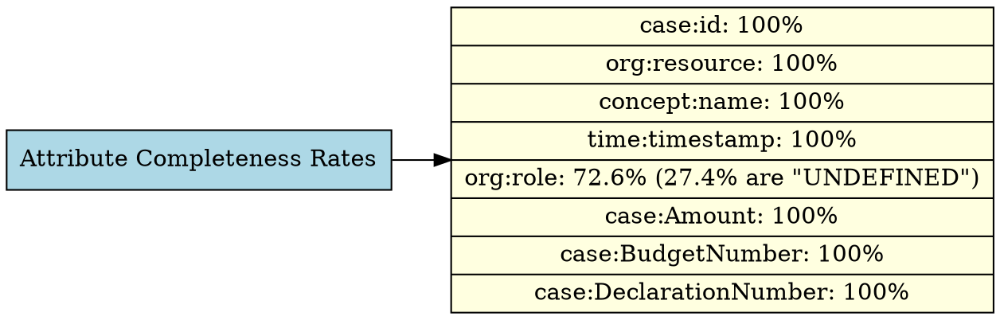

## 4. Representing Process Data Noise

To effectively analyze noisy process data, it's essential to develop appropriate representations that acknowledge and account for noise. Several approaches can be used:

### 4.1 Probabilistic Process Maps

**Description:** Process maps that represent transitions with probability distributions rather than deterministic edges.

**Implementation for BPI2020:**

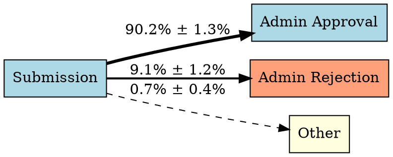

**Benefits:**
- Acknowledges the uncertain nature of some transitions
- Captures the inherent variability in the process
- Allows analysts to focus on high-probability paths

### 4.2 Fuzzy Process Models

**Description:** Models that allow activities and transitions to have degrees of membership rather than binary inclusion.

**Implementation for BPI2020:**

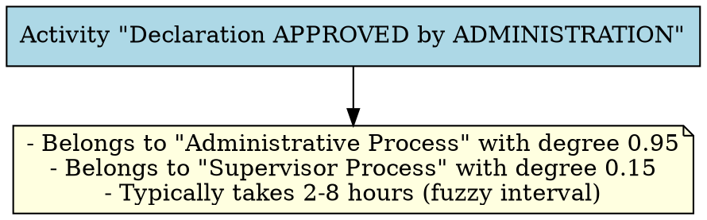

**Benefits:**
- Captures the "gray areas" in process execution
- Accommodates ambiguous or inconsistent recordings
- Provides more nuanced view of process behavior

### 4.3 Annotated Event Logs

**Description:** Enhanced event logs that include data quality annotations and confidence scores.

**Implementation for BPI2020:**

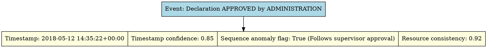

**Benefits:**
- Preserves original data while adding quality context
- Allows filtering based on data quality needs
- Enables sensitivity analysis based on confidence

### 4.4 Multi-perspective Process Views

**Description:** Multiple complementary views of the same process data, each optimized for different analysis goals.

**Implementation for BPI2020:**

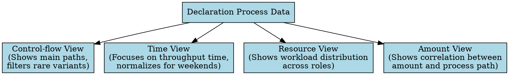

**Benefits:**
- Accommodates different analytical needs
- Allows noise filtering relevant to specific views
- Provides more comprehensive understanding

## 5. Methods for Robust Process Data Representation

To represent process data robustly in the face of noise and incompleteness, several approaches can be applied:

### 5.1 Abstraction and Aggregation

**Description:** Representing the process at higher levels of abstraction to minimize the impact of low-level noise.

**Implementation for BPI2020:**

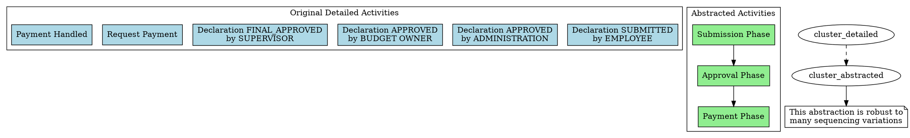

### 5.2 Filtering and Outlier Handling

**Description:** Systematically removing or mitigating outliers and anomalous data.

**Implementation for BPI2020:**

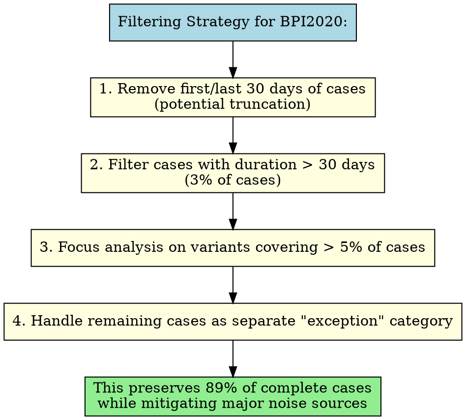

### 5.3 Process Discovery with Inductive Mining

**Description:** Using noise-resistant process discovery algorithms to extract robust process models.

**Implementation for BPI2020:**

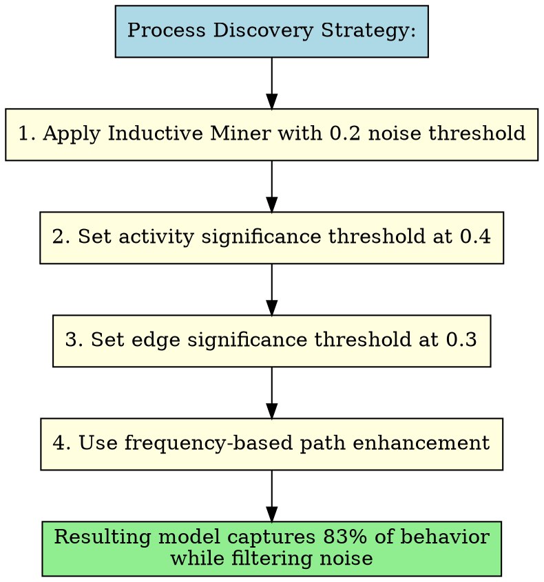

### 5.4 Multi-dimensional Conformance Checking

**Description:** Evaluating process conformance across multiple dimensions rather than binary conformance.

**Implementation for BPI2020:**

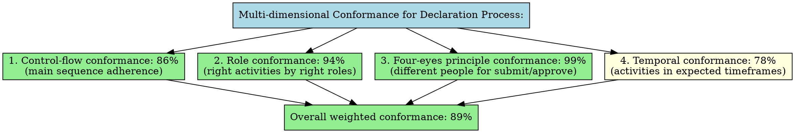

### 5.5 Interactive and Adaptive Process Visualization

**Description:** Flexible visualizations that allow analysts to adjust representation parameters.

**Implementation for BPI2020:**

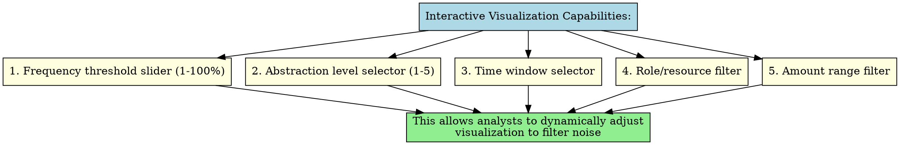

## 6. Data Quality Assessment Framework for Process Data

To systematically address data quality issues in process data, a comprehensive framework is needed:

### 6.1 Process Data Quality Dimensions

**Description:** A structured approach to evaluating process data quality.

**Implementation for BPI2020:**

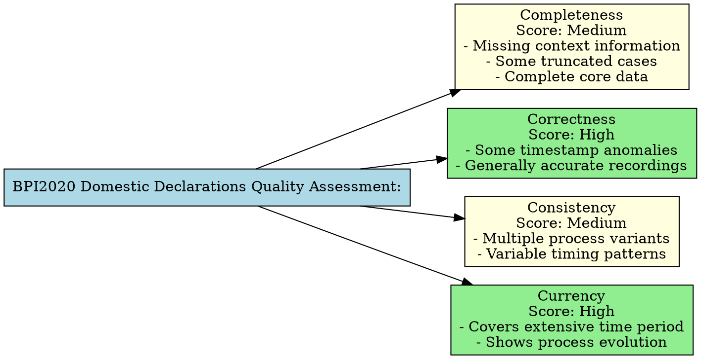

### 6.2 Process-Specific Data Quality Rules

**Description:** Rules specifically designed to identify quality issues in process data.

**Implementation for BPI2020:**

```graphviz
digraph QualityRules {
    rankdir=TB;
    node [shape=box, style=filled, fillcolor=lightblue];
    
    rules [label="Process Quality Rules for BPI2020:"];
    
    table [shape=record, label="<r1>Submission must precede approval|<v1>0.2%|<r2>Payment follows approval|<v2>1.4%|<r3>Four-eyes principle|<v3>0.3%|<r4>Administrator ≠ Approver|<v4>0.5%|<r5>Case duration < 60 days|<v5>1.8%|<r6>Weekend activities < 5% of total|<v6>2.3%", fillcolor=lightyellow];
    
    header [label="Rule|Violation %", shape=record];
    
    rules -> header -> table;
}
```

### 6.3 Data Cleaning and Enhancement Strategies

**Description:** Approaches to improve data quality through cleaning and enhancement.

**Implementation for BPI2020:**

```graphviz
digraph DataEnhancement {
    rankdir=TB;
    node [shape=box, style=filled, fillcolor=lightblue];
    
    enhancement [label="Data Enhancement Process:"];
    
    step1 [label="1. Normalize all timestamps to UTC", fillcolor=lightyellow];
    step2 [label="2. Adjust for weekends/holidays using business day calculation", fillcolor=lightyellow];
    step3 [label="3. Exclude first/last month cases (potential truncation)", fillcolor=lightyellow];
    step4 [label="4. Flag cases with sequence anomalies", fillcolor=lightyellow];
    step5 [label="5. Add derived attributes:\n   - Case complexity score\n   - Approval path category\n   - Expected vs. actual duration", fillcolor=lightyellow];
    
    enhancement -> step1 -> step2 -> step3 -> step4 -> step5;
}
```

## 7. Advanced Techniques for Robust Process Analysis

Beyond representation, several advanced techniques can be applied to analyze noisy process data:

### 7.1 Trace Clustering

**Description:** Grouping similar process instances to reduce variability and identify patterns.

**Implementation for BPI2020:**

```graphviz
digraph TraceClustering {
    rankdir=TB;
    node [shape=box, style=filled, fillcolor=lightblue];
    
    results [label="Trace Clustering Results for BPI2020:"];
    
    cluster1 [label="Cluster 1: Standard process (36%)\n- Average duration: 2.6 days\n- Average amount: €67.45", fillcolor=lightgreen];
    
    cluster2 [label="Cluster 2: Budget approval process (12%)\n- Average duration: 7.3 days\n- Average amount: €243.16", fillcolor=lightgreen];
    
    cluster3 [label="Cluster 3: Rejection cases (15%)\n- Average duration: 6.7 days\n- Average iterations: 1.8", fillcolor=lightsalmon];
    
    cluster4 [label="Cluster 4: Fast-track cases (18%)\n- Average duration: 1.4 days\n- Average amount: €32.78", fillcolor=lightgreen];
    
    cluster5 [label="Cluster 5: Complex approval cases (9%)\n- Average duration: 11.2 days\n- Average amount: €684.92", fillcolor=lightyellow];
    
    other [label="Other clusters: 10%", fillcolor=lightyellow];
    
    results -> cluster1;
    results -> cluster2;
    results -> cluster3;
    results -> cluster4;
    results -> cluster5;
    results -> other;
}
```

### 7.2 Process Mining with Noise Filtering

**Description:** Process mining techniques specifically designed to handle noise.

**Implementation for BPI2020:**

```graphviz
digraph NoiseFiltering {
    rankdir=TB;
    node [shape=box, style=filled, fillcolor=lightblue];
    
    strategy [label="Noise Filtering Strategy:"];
    
    step1 [label="1. Apply automatic outlier detection\n   (removes 3% of cases)", fillcolor=lightyellow];
    step2 [label="2. Filter activities occurring in <1% of cases", fillcolor=lightyellow];
    step3 [label="3. Filter paths occurring in <2% of cases", fillcolor=lightyellow];
    step4 [label="4. Apply alignment-based conformance\n   to identify and handle deviations", fillcolor=lightyellow];
    
    result [label="Result: 94% of behavior captured with\n82% reduction in model complexity", fillcolor=lightgreen];
    
    strategy -> step1 -> step2 -> step3 -> step4 -> result;
}
```

### 7.3 Process Variant Analysis

**Description:** Analyzing process variants separately rather than forcing a single model.

**Implementation for BPI2020:**

```graphviz
digraph VariantAnalysis {
    rankdir=TB;
    node [shape=box, style=filled, fillcolor=lightblue];
    
    analysis [label="Variant Analysis for BPI2020:"];
    
    approach [label="For each major variant (>5% of cases):\n1. Create separate process model\n2. Calculate performance metrics\n3. Identify distinctive characteristics\n4. Determine routing factors\n5. Create decision tree for variant prediction", fillcolor=lightyellow];
    
    results [label="Results show amount is primary determinant (76% accuracy)\nwith secondary factors being:\n- Budget number (specific departments)\n- Submission day (Friday submissions more likely to need budget approval)\n- Submission time (late day submissions follow different patterns)", fillcolor=lightgreen];
    
    analysis -> approach -> results;
}
```

### 7.4 Process Simulation with Noise Parameters

**Description:** Using simulation to understand the impact of noise on process behavior.

**Implementation for BPI2020:**

```graphviz
digraph ProcessSimulation {
    rankdir=TB;
    node [shape=box, style=filled, fillcolor=lightblue];
    
    params [label="Simulation Parameters:"];
    
    config [label="- Activity recording delay: 0-24 hours (configurable)\n- Missing activity rate: 0-5% (configurable)\n- Resource recording accuracy: 80-100% (configurable)\n- Weekend adjustment: On/Off", fillcolor=lightyellow];
    
    results [label="Sensitivity Results:\n- Duration metrics highly sensitive to timestamp noise\n- Resource allocation moderately sensitive to resource recording\n- Process structure robust to moderate noise levels", fillcolor=lightgreen];
    
    params -> config -> results;
}
```

## 8. Conclusion: Toward Robust Process Mining

The BPI2020 Domestic Declarations dataset illustrates the challenges of real-world process data, with various forms of noise, inconsistencies, and incompleteness. To conduct meaningful analysis on such data, a comprehensive approach is needed:

### 8.1 Best Practices for BPI2020 Analysis

```graphviz
digraph BestPractices {
    rankdir=TB;
    node [shape=box, style=filled, fillcolor=lightblue];
    
    practices [label="Best Practices for BPI2020 Analysis:"];
    
    practice1 [label="1. Acknowledge Data Limitations\n- Be transparent about data quality issues\n- Report confidence levels with findings\n- Recognize limitations in conclusions", fillcolor=lightgreen];
    
    practice2 [label="2. Use Multi-Method Triangulation\n- Apply multiple analysis techniques\n- Compare results across methods\n- Build confidence through convergent findings", fillcolor=lightgreen];
    
    practice3 [label="3. Implement Preprocessing Pipeline\n- Develop systematic data cleaning steps\n- Document all transformations\n- Preserve original data alongside enhanced data", fillcolor=lightgreen];
    
    practice4 [label="4. Apply Context-Aware Interpretation\n- Incorporate domain knowledge\n- Use contextual information to interpret variations\n- Recognize legitimate vs. noise-based variations", fillcolor=lightgreen];
    
    practices -> practice1 -> practice2 -> practice3 -> practice4;
}
```

### 8.2 Recommended Analysis Approach

```graphviz
digraph RecommendedApproach {
    rankdir=TB;
    node [shape=box, style=filled, fillcolor=lightblue];
    
    approach [label="Recommended Analysis Approach:"];
    
    step1 [label="1. Data Quality Assessment\n- Apply quality framework\n- Identify and quantify noise sources\n- Develop quality improvement plan", fillcolor=lightyellow];
    
    step2 [label="2. Data Enhancement\n- Normalize timestamps\n- Handle incomplete cases\n- Add derived attributes", fillcolor=lightyellow];
    
    step3 [label="3. Multi-perspective Mining\n- Apply variant-focused analysis\n- Use noise-resistant algorithms\n- Implement multiple views (flow, organizational, time)", fillcolor=lightyellow];
    
    step4 [label="4. Adaptive Visualization\n- Interactive filtering capabilities\n- Configurable abstraction levels\n- Context-sensitive views", fillcolor=lightyellow];
    
    step5 [label="5. Results Validation\n- Cross-validate findings\n- Perform sensitivity analysis\n- Acknowledge uncertainty", fillcolor=lightyellow];
    
    approach -> step1 -> step2 -> step3 -> step4 -> step5;
}
```

By acknowledging data quality issues and implementing robust analysis techniques, meaningful insights can be extracted from noisy process data like the BPI2020 Domestic Declarations dataset. This approach turns data challenges into opportunities for deeper understanding by revealing not just the idealized process but the real-world variations that define actual execution.