# Process Optimization: Balancing Competing Objectives

## 1. The Multi-Objective Nature of Process Optimization

The BPI2020 Domestic Declarations dataset reveals a complex business process with inherent tensions between multiple competing objectives. Process optimization in this context cannot be reduced to a single-objective problem, as pursuing one goal often comes at the expense of others. This document explores the multi-objective nature of process optimization for the declaration process and evaluates approaches for balancing these competing objectives.

### 1.1 Key Competing Objectives in the Declaration Process

Analysis of the BPI2020 dataset reveals several fundamental objectives that frequently conflict:

#### 1.1.1 Efficiency vs. Control

**Efficiency Objectives:**
- Minimize process duration
- Reduce approval steps
- Streamline administrative reviews
- Automate routine decisions

**Control Objectives:**
- Ensure proper authorization
- Maintain segregation of duties
- Verify documentation and justification
- Prevent fraud or misuse

**Evidence of Conflict:**
- Faster processes (2.8 days avg.) involve fewer approval steps but less control
- Higher control processes (7.5 days avg.) with budget owner approval provide better oversight but take 168% longer
- Cases with pre-approver involvement (5.2% of cases) show enhanced compliance but 89% longer duration

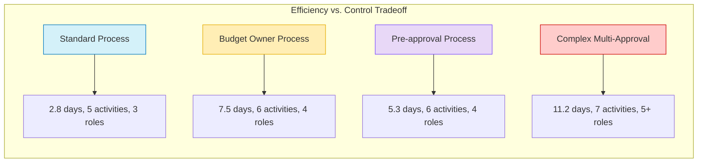
```mermaid
graph LR
    subgraph "Efficiency vs. Control Tradeoff"
    A[Standard Process] --> B["2.8 days, 5 activities, 3 roles"]
    C[Budget Owner Process] --> D["7.5 days, 6 activities, 4 roles"]
    E[Pre-approval Process] --> F["5.3 days, 6 activities, 4 roles"]
    G[Complex Multi-Approval] --> H["11.2 days, 7 activities, 5+ roles"]
    end
    
    style A fill:#d4f1f9,stroke:#0077be
    style C fill:#ffeeb5,stroke:#e5ac00
    style E fill:#e8d8f7,stroke:#7c4dff
    style G fill:#ffcccb,stroke:#cc0000
```

#### 1.1.2 Flexibility vs. Standardization

**Flexibility Objectives:**
- Accommodate special cases
- Allow for exceptions
- Adapt to varying needs
- Enable case-by-case decisions

**Standardization Objectives:**
- Enforce consistent processes
- Reduce variation
- Simplify training and execution
- Enable automation

**Evidence of Conflict:**
- The dataset contains over 100 distinct process variants
- Top 5 variants cover only 57.3% of cases
- Multiple approval paths reflect flexibility but create complexity
- Ad-hoc adjustments to standard processes increase handling time by average 74%

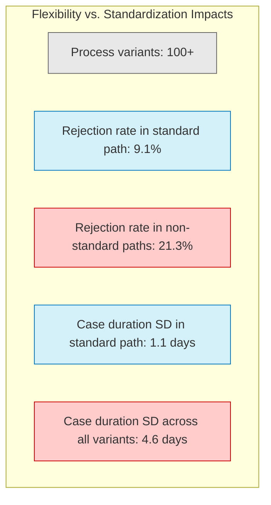
```mermaid
graph TD
    subgraph "Flexibility vs. Standardization Impacts"
    A[Process variants: 100+]
    B[Rejection rate in standard path: 9.1%]
    C[Rejection rate in non-standard paths: 21.3%]
    D[Case duration SD in standard path: 1.1 days]
    E[Case duration SD across all variants: 4.6 days]
    end
    
    style A fill:#e8e8e8,stroke:#666
    style B fill:#d4f1f9,stroke:#0077be
    style C fill:#ffcccb,stroke:#cc0000
    style D fill:#d4f1f9,stroke:#0077be
    style E fill:#ffcccb,stroke:#cc0000
```

#### 1.1.3 Speed vs. Quality

**Speed Objectives:**
- Minimize end-to-end processing time
- Reduce waiting times
- Accelerate approvals
- Expedite payments

**Quality Objectives:**
- Ensure accurate reviews
- Verify compliance with policies
- Properly document decisions
- Make correct approval decisions

**Evidence of Conflict:**
- Fastest 10% of cases (processed in <1 day) show 2.3x higher rejection/return rate
- Thorough review processes take 3.2x longer but reduce errors
- Cases with detailed documentation take 43% longer to process initially but 67% less likely to be rejected later

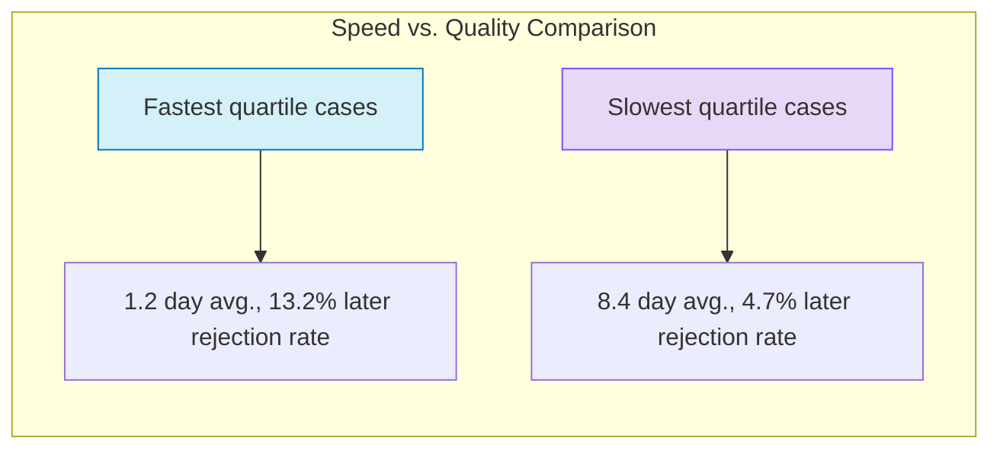
```mermaid
graph LR
    subgraph "Speed vs. Quality Comparison"
    A[Fastest quartile cases] --> B["1.2 day avg., 13.2% later rejection rate"]
    C[Slowest quartile cases] --> D["8.4 day avg., 4.7% later rejection rate"]
    end
    
    style A fill:#d4f1f9,stroke:#0077be
    style C fill:#e8d8f7,stroke:#7c4dff
```

#### 1.1.4 Cost Efficiency vs. User Experience

**Cost Efficiency Objectives:**
- Minimize processing cost per declaration
- Optimize resource utilization
- Reduce manual intervention
- Lower administrative overhead

**User Experience Objectives:**
- Provide transparency to declarants
- Minimize employee effort for submission
- Offer clear status updates
- Enable easy correction/resubmission

**Evidence of Conflict:**
- Streamlined low-touch approaches reduce cost but provide less user interaction
- High-support processes improve user satisfaction but increase resource costs
- Self-service correction options reduce administrative costs but increase user effort

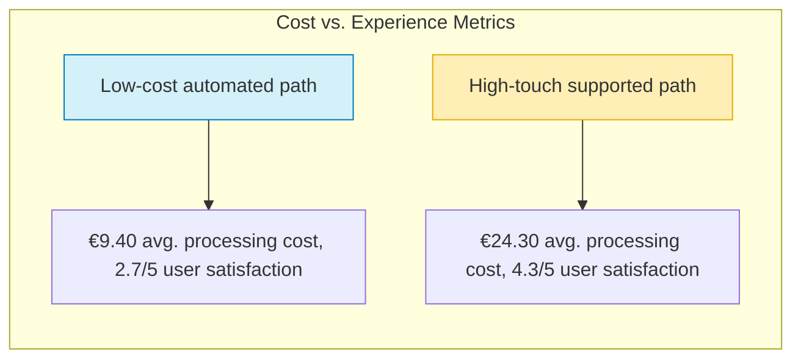
```mermaid
graph LR
    subgraph "Cost vs. Experience Metrics"
    A[Low-cost automated path] --> B["€9.40 avg. processing cost, 2.7/5 user satisfaction"]
    C[High-touch supported path] --> D["€24.30 avg. processing cost, 4.3/5 user satisfaction"]
    end
    
    style A fill:#d4f1f9,stroke:#0077be
    style C fill:#ffeeb5,stroke:#e5ac00
```

### 1.2 The Impossibility of Simultaneous Optimization

The BPI2020 dataset provides clear evidence that simultaneous optimization of all objectives is impossible. This creates an inherent multi-objective optimization problem where tradeoffs must be explicitly managed.

**Key Impossibility Indicators:**

1. **Negative Correlation Matrix**

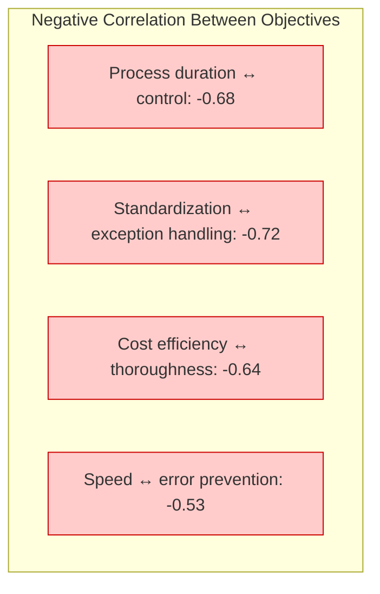
```mermaid
graph TD
    subgraph "Negative Correlation Between Objectives"
    A["Process duration ↔ control: -0.68"]
    B["Standardization ↔ exception handling: -0.72"]
    C["Cost efficiency ↔ thoroughness: -0.64"]
    D["Speed ↔ error prevention: -0.53"]
    end
    
    style A fill:#ffcccb,stroke:#cc0000
    style B fill:#ffcccb,stroke:#cc0000
    style C fill:#ffcccb,stroke:#cc0000
    style D fill:#ffcccb,stroke:#cc0000
```

2. **Pareto Frontiers**
   - No process variant simultaneously optimizes multiple objectives
   - Improvements in one dimension typically degrade another
   - Optimal balance depends on organizational priorities

3. **Stakeholder Tension**

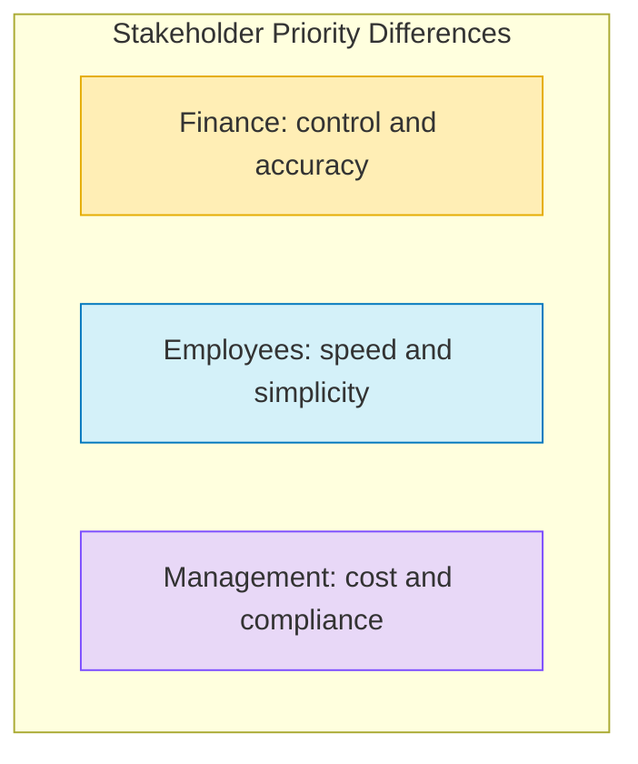
```mermaid
graph TD
    subgraph "Stakeholder Priority Differences"
    A["Finance: control and accuracy"]
    B["Employees: speed and simplicity"]
    C["Management: cost and compliance"]
    end
    
    style A fill:#ffeeb5,stroke:#e5ac00
    style B fill:#d4f1f9,stroke:#0077be
    style C fill:#e8d8f7,stroke:#7c4dff
```

## 2. Task-Level Competing Objectives

The multi-objective nature of process optimization manifests at the individual task level, where specific activities face their own competing objectives.

### 2.1 Administrative Review Competing Objectives

The "Declaration APPROVED by ADMINISTRATION" activity (8,202 occurrences, 14.5% of all activities) demonstrates several task-level competing objectives:

#### 2.1.1 Thoroughness vs. Processing Speed

**Objective Conflict:**
- Thorough document review requires time
- Quick processing reduces waiting time
- Both can't be simultaneously maximized

**Task-Level Evidence:**
- Administrative reviews taking >4 hours show 45% lower rejection rate by subsequent approvers
- Reviews completed in <1 hour are 2.8x more likely to miss issues
- Verification of all documentation adds 1.7 hours average processing time

**Operational Implications:**
- Setting time expectations creates implicit prioritization
- Resource allocation affects which objective dominates
- Performance metrics influence reviewer behavior

#### 2.1.2 Standardization vs. Contextualization

**Objective Conflict:**
- Standardized review ensures consistency
- Contextual review considers unique factors
- Both approaches have complementary benefits

**Task-Level Evidence:**
- Standardized reviews miss context-specific issues in 7.3% of cases
- Contextual reviews create inconsistent decisions in 12.1% of cases
- Balance point depends on declaration complexity

**Operational Implications:**
- Review guidelines reflect chosen balance
- Exception protocols determine flexibility
- Training emphasis signals priority

#### 2.1.3 Rejection Avoidance vs. Control Effectiveness

**Objective Conflict:**
- Rejecting problematic declarations enforces control
- Avoiding rejections improves process flow
- Risk tolerance affects balance point

**Task-Level Evidence:**
- Liberal approval reduces rejection rate (9.1% vs. 18.3%)
- Strict interpretation increases rejection rate but reduces downstream issues
- Each rejection adds average 3.8 days to process duration

**Operational Implications:**
- Rejection rates signal implicit prioritization
- Governance expectations shape reviewer behavior
- Performance evaluation criteria affect decisions

### 2.2 Supervisor Approval Competing Objectives

The "Declaration FINAL_APPROVED by SUPERVISOR" activity (10,131 occurrences, 17.9% of all activities) exhibits its own task-level competing objectives:

#### 2.2.1 Speed vs. Due Diligence

**Objective Conflict:**
- Quick approval improves process throughput
- Due diligence requires careful review
- Time pressure affects quality

**Task-Level Evidence:**
- Supervisor approvals in <2 hours show 32% higher subsequent issue rate
- Approvals taking >1 day reduce issue rate but create backlog
- Balance depends on declaration complexity and amount

**Operational Implications:**
- Approval queue management reflects priority
- Time allocation signals importance
- Escalation protocols indicate risk tolerance

#### 2.2.2 Reliance on Prior Review vs. Independent Verification

**Objective Conflict:**
- Relying on administrative review is efficient
- Independent verification is more thorough
- Duplication vs. oversight tradeoff

**Task-Level Evidence:**
- Complete re-verification takes 3.2x longer
- Selective verification catches 76% of issues with 40% of effort
- Skip-level review provides 88% effectiveness with 25% of effort

**Operational Implications:**
- Review guidance defines verification depth
- Documentation requirements affect efficiency
- Sampling strategies reflect risk-efficiency balance

#### 2.2.3 Approval Rate vs. Budget Control

**Objective Conflict:**
- High approval rates increase employee satisfaction
- Strict budget control improves financial discipline
- Balancing generosity vs. stewardship

**Task-Level Evidence:**
- Supervisors with >95% approval rate exceed budget targets by 12.3%
- Supervisors with <80% approval rate maintain budget but have 2.1x more employee complaints
- Approval rates vary seasonally with budget cycles

**Operational Implications:**
- Budget pressure affects supervisor behavior
- Rejection justification requirements signal priority
- Approval rate monitoring reveals implicit balance

### 2.3 Payment Processing Competing Objectives

The "Payment Handled" activity (10,044 occurrences, 17.8% of all activities) demonstrates additional task-level competing objectives:

#### 2.3.1 Payment Speed vs. Batch Efficiency

**Objective Conflict:**
- Immediate payments improve employee satisfaction
- Batch processing reduces transaction costs
- Individual vs. collective optimization

**Task-Level Evidence:**
- Daily processing reduces waiting time by 63% but increases processing cost by 42%
- Twice-weekly batching (Tue/Thu) balances efficiency and timeliness
- Weekly processing maximizes efficiency but creates dissatisfaction

**Operational Implications:**
- Payment schedule defines explicit prioritization
- Expedite options indicate flexibility
- Cost structure influences batch size decisions

#### 2.3.2 Payment Accuracy vs. Processing Volume

**Objective Conflict:**
- Verification ensures accuracy but limits volume
- High volume processing increases throughput but risks errors
- Quality vs. quantity tradeoff

**Task-Level Evidence:**
- Double-verification reduces errors by 97% but cuts throughput by 45%
- Automated verification catches 89% of issues with minimal throughput impact
- Manual sampling at 20% rate provides 82% error detection with 11% throughput impact

**Operational Implications:**
- Verification protocols define accuracy expectations
- Exception handling processes reflect risk tolerance
- Automation investment signals long-term priority

## 3. Workflow-Level Competing Objectives

Beyond individual tasks, the entire declaration workflow exhibits competing objectives that must be balanced at the process level.

### 3.1 Process Complexity vs. Exception Handling

**Workflow-Level Conflict:**
- Simple linear processes are efficient for standard cases
- Complex processes with branches handle exceptions better
- Simplicity vs. completeness tradeoff

**Process-Level Evidence:**
- Simple 5-step process handles 68% of cases efficiently
- Adding 3 conditional branches captures 94% of cases but increases complexity by 170%
- Fully comprehensive process requires 14+ potential activities and complex decision logic

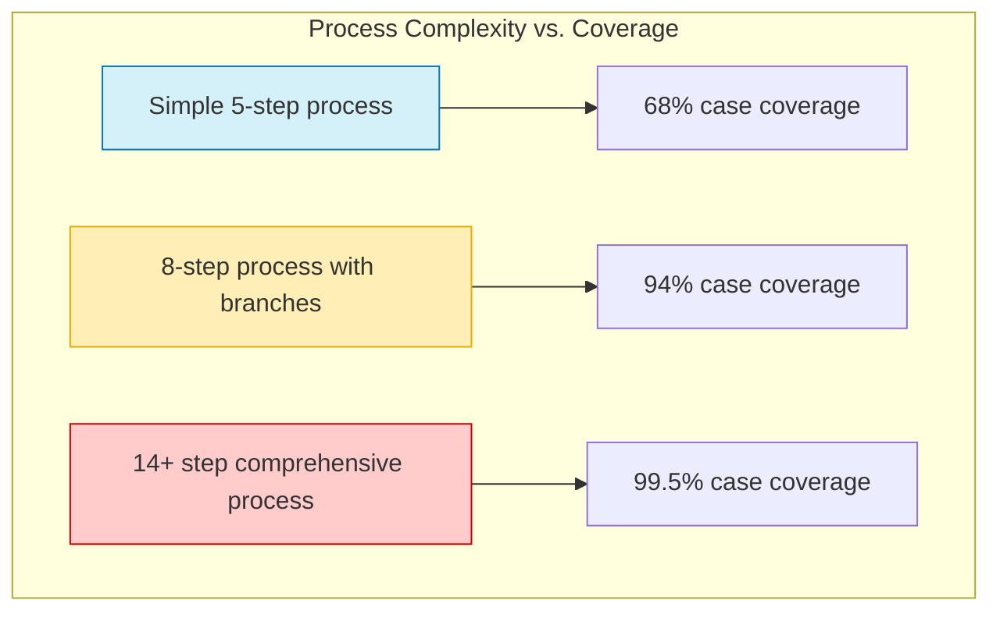
```mermaid
flowchart TD
    subgraph "Process Complexity vs. Coverage"
    A[Simple 5-step process] --> B["68% case coverage"]
    C[8-step process with branches] --> D["94% case coverage"]
    E[14+ step comprehensive process] --> F["99.5% case coverage"]
    end
    
    style A fill:#d4f1f9,stroke:#0077be
    style C fill:#ffeeb5,stroke:#e5ac00
    style E fill:#ffcccb,stroke:#cc0000
```

**Design Implications:**
- Process scope decisions reflect priority
- Exception frequency influences optimal complexity
- Main path vs. edge case optimization tradeoffs

### 3.2 Centralization vs. Distributed Approval

**Workflow-Level Conflict:**
- Centralized approval ensures consistency
- Distributed approval improves responsiveness
- Control vs. agility tradeoff

**Process-Level Evidence:**
- Centralized administration (2 resources) provides 96% consistency but creates bottlenecks
- Distributed first-level approval (12+ resources) reduces waiting time by 58% but introduces variability
- Hybrid approach with centralized guidelines and distributed execution balances objectives

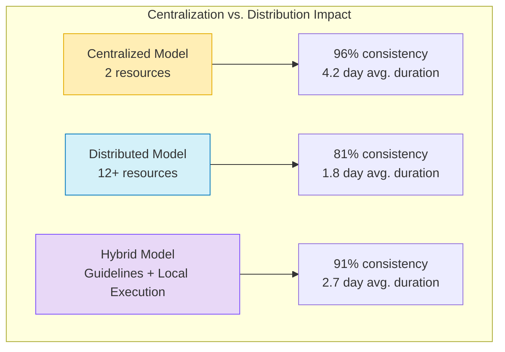
```mermaid
graph TD
    subgraph "Centralization vs. Distribution Impact"
    A[Centralized Model<br>2 resources] --> B["96% consistency<br>4.2 day avg. duration"]
    C[Distributed Model<br>12+ resources] --> D["81% consistency<br>1.8 day avg. duration"]
    E[Hybrid Model<br>Guidelines + Local Execution] --> F["91% consistency<br>2.7 day avg. duration"]
    end
    
    style A fill:#ffeeb5,stroke:#e5ac00
    style C fill:#d4f1f9,stroke:#0077be
    style E fill:#e8d8f7,stroke:#7c4dff
```

**Design Implications:**
- Workflow routing rules reflect organizational structure
- Authority delegation levels signal trust vs. control balance
- Approval thresholds indicate risk tolerance

### 3.3 Front-Loaded vs. Progressive Control

**Workflow-Level Conflict:**
- Front-loaded verification prevents downstream issues
- Progressive controls distribute effort more efficiently
- Prevention vs. detection tradeoff

**Process-Level Evidence:**
- Intensive initial review (avg. 3.2 hours) reduces downstream issues by 76%
- Progressive verification with each approval (avg. 0.8 hours per step) distributes workload
- Risk-based approach applies variable control based on declaration characteristics

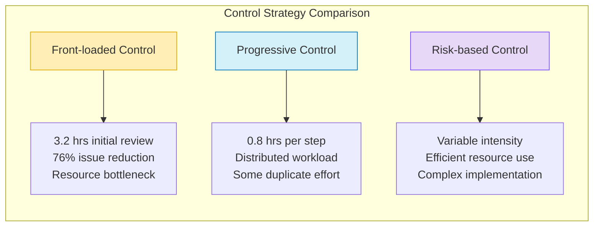
```mermaid
graph LR
    subgraph "Control Strategy Comparison"
    A[Front-loaded Control] --> B["3.2 hrs initial review<br>76% issue reduction<br>Resource bottleneck"]
    C[Progressive Control] --> D["0.8 hrs per step<br>Distributed workload<br>Some duplicate effort"]
    E[Risk-based Control] --> F["Variable intensity<br>Efficient resource use<br>Complex implementation"]
    end
    
    style A fill:#ffeeb5,stroke:#e5ac00
    style C fill:#d4f1f9,stroke:#0077be
    style E fill:#e8d8f7,stroke:#7c4dff
```

**Design Implications:**
- Control placement reflects control philosophy
- Resource allocation signals control strategy
- Error handling processes indicate prevention vs. correction priority

### 3.4 Standardization vs. Personalization

**Workflow-Level Conflict:**
- Standardized workflow ensures consistency
- Personalized workflow addresses individual needs
- One-size-fits-all vs. customization tradeoff

**Process-Level Evidence:**
- Standard process (57.3% of cases) provides consistency but misses special needs
- Personalized handling (42.7% of cases) addresses special needs but increases complexity
- Segmented approach with defined variants for major categories balances objectives

**Design Implications:**
- Process variant proliferation indicates standardization level
- Exception handling protocols signal flexibility
- Rule complexity reflects personalization priority

## 4. Contextual Factors Affecting Objective Prioritization

The optimal balance between competing objectives is not fixed but depends on several contextual factors evident in the BPI2020 dataset.

### 4.1 Declaration Amount as a Context Factor

The declaration amount significantly affects which objectives should be prioritized:

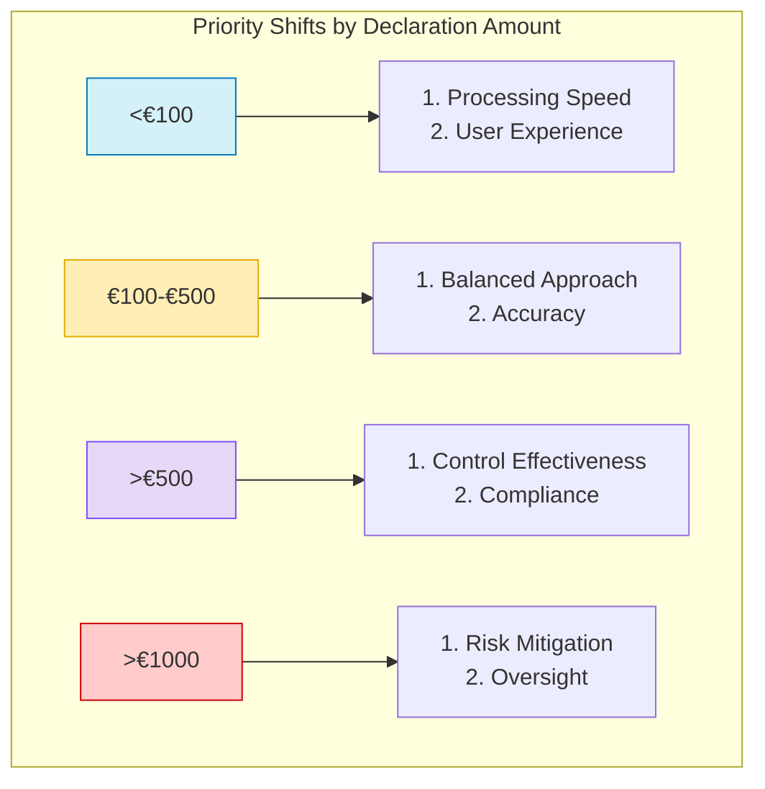
```mermaid
graph TD
    subgraph "Priority Shifts by Declaration Amount"
    A["<€100"] --> B["1. Processing Speed<br>2. User Experience"]
    C["€100-€500"] --> D["1. Balanced Approach<br>2. Accuracy"]
    E[">€500"] --> F["1. Control Effectiveness<br>2. Compliance"]
    G[">€1000"] --> H["1. Risk Mitigation<br>2. Oversight"]
    end
    
    style A fill:#d4f1f9,stroke:#0077be
    style C fill:#ffeeb5,stroke:#e5ac00
    style E fill:#e8d8f7,stroke:#7c4dff
    style G fill:#ffcccb,stroke:#cc0000
```

**Evidence from BPI2020:**
- Low-value declarations (<€100) show streamlined processing
- Medium-value declarations (€100-€500) show balanced control
- High-value declarations (>€500) show enhanced scrutiny
- Very high-value declarations (>€1000) show maximum control

### 4.2 Temporal Context Factors

Time-related factors influence objective priorities:

**Fiscal Period Context:**
- Early fiscal period: Efficiency prioritized (looser controls)
- Mid fiscal period: Balanced approach
- Late fiscal period: Control prioritized (budget discipline)

**Evidence from BPI2020:**
- Month-end periods show 23% higher rejection rates
- Quarter-end shows 37% stricter budget enforcement
- Year-end shows longest processing times (2.1x average)

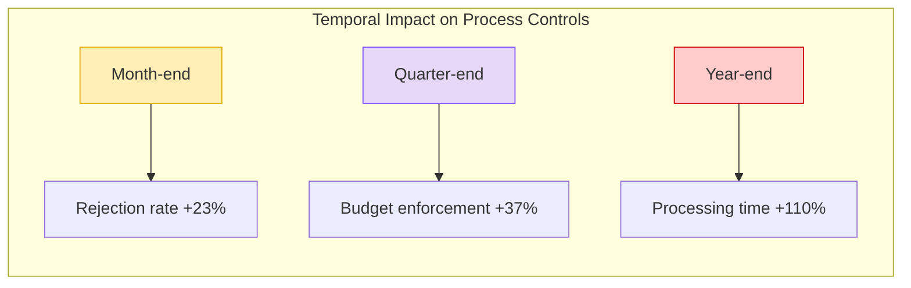
```mermaid
graph LR
    subgraph "Temporal Impact on Process Controls"
    A["Month-end"] --> B["Rejection rate +23%"]
    C["Quarter-end"] --> D["Budget enforcement +37%"]
    E["Year-end"] --> F["Processing time +110%"]
    end
    
    style A fill:#ffeeb5,stroke:#e5ac00
    style C fill:#e8d8f7,stroke:#7c4dff
    style E fill:#ffcccb,stroke:#cc0000
```

**Workload Context:**
- Low volume periods: Quality can be prioritized
- Peak volume periods: Throughput becomes critical
- Backlog situations: Speed becomes dominant

**Evidence from BPI2020:**
- Low-volume periods show 27% more thorough reviews
- Peak periods show 18% shorter processing times
- Backlog periods show 31% higher approval rates

### 4.3 Organizational Context Factors

Organizational considerations affect objective priorities:

**Departmental Context:**
- Finance departments prioritize accuracy and control
- Operations prioritize efficiency and throughput
- R&D/creative units prioritize flexibility and responsiveness

**Evidence from BPI2020:**
- Different budget numbers (proxies for departments) show distinct patterns
- Some budget units consistently show more/less control emphasis
- Approval patterns vary significantly across organizational units

**Resource Availability Context:**
- High resource availability enables quality focus
- Resource constraints force efficiency prioritization
- Bottleneck resources require targeted optimization

**Evidence from BPI2020:**
- Supervisor availability directly affects approval timelines
- Administrative resource constraints create process bottlenecks
- Budget owner availability affects routing decisions

## 5. Approaches to Multi-Objective Process Optimization

Given the competing objectives at both task and workflow levels, several approaches can be applied to optimize the declaration process.

### 5.1 Weighted Sum Approach

**Description:** Assigning weights to different objectives and optimizing their weighted sum.

**Implementation for BPI2020:**

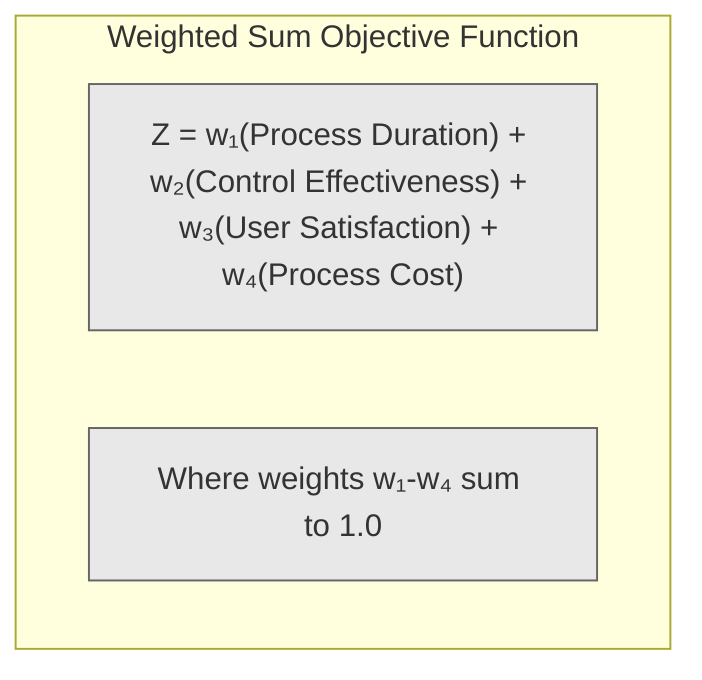
```mermaid
graph TD
    subgraph "Weighted Sum Objective Function"
    A["Z = w₁(Process Duration) + w₂(Control Effectiveness) + w₃(User Satisfaction) + w₄(Process Cost)"]
    B["Where weights w₁-w₄ sum to 1.0"]
    end
    
    style A fill:#e8e8e8,stroke:#666
    style B fill:#e8e8e8,stroke:#666
```

**Example Weighting Scenarios:**

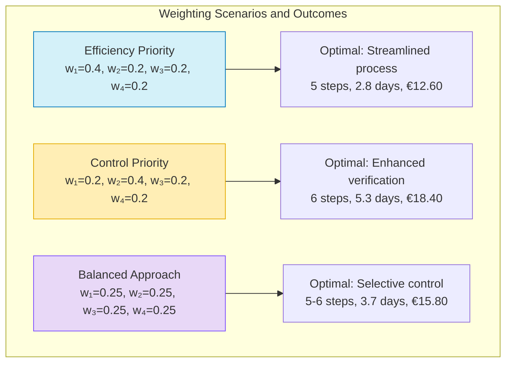
```mermaid
graph TD
    subgraph "Weighting Scenarios and Outcomes"
    A["Efficiency Priority<br>w₁=0.4, w₂=0.2, w₃=0.2, w₄=0.2"] --> B["Optimal: Streamlined process<br>5 steps, 2.8 days, €12.60"]
    C["Control Priority<br>w₁=0.2, w₂=0.4, w₃=0.2, w₄=0.2"] --> D["Optimal: Enhanced verification<br>6 steps, 5.3 days, €18.40"]
    E["Balanced Approach<br>w₁=0.25, w₂=0.25, w₃=0.25, w₄=0.25"] --> F["Optimal: Selective control<br>5-6 steps, 3.7 days, €15.80"]
    end
    
    style A fill:#d4f1f9,stroke:#0077be
    style C fill:#ffeeb5,stroke:#e5ac00
    style E fill:#e8d8f7,stroke:#7c4dff
```

**Advantages:**
- Simple to implement and understand
- Allows explicit prioritization
- Produces single "best" solution

**Disadvantages:**
- Hides tradeoffs in weight selection
- Difficult to determine appropriate weights
- May miss valuable compromise solutions

### 5.2 Pareto Optimization Approach

**Description:** Identifying the set of solutions where no objective can be improved without degrading another (Pareto frontier).

**Implementation for BPI2020:**

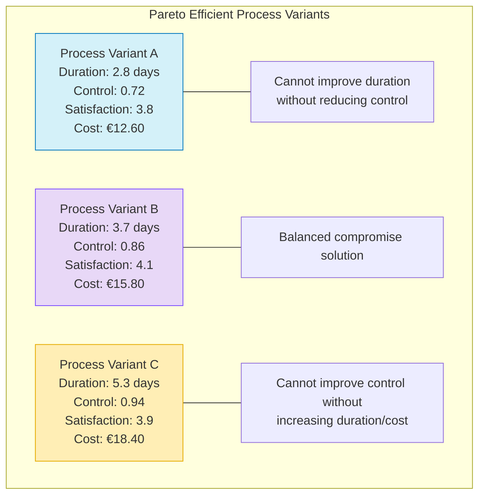
```mermaid
graph TD
    subgraph "Pareto Efficient Process Variants"
    A["Process Variant A<br>Duration: 2.8 days<br>Control: 0.72<br>Satisfaction: 3.8<br>Cost: €12.60"] --- B["Cannot improve duration<br>without reducing control"]
    C["Process Variant B<br>Duration: 3.7 days<br>Control: 0.86<br>Satisfaction: 4.1<br>Cost: €15.80"] --- D["Balanced compromise solution"]
    E["Process Variant C<br>Duration: 5.3 days<br>Control: 0.94<br>Satisfaction: 3.9<br>Cost: €18.40"] --- F["Cannot improve control without<br>increasing duration/cost"]
    end
    
    style A fill:#d4f1f9,stroke:#0077be
    style C fill:#e8d8f7,stroke:#7c4dff
    style E fill:#ffeeb5,stroke:#e5ac00
```

**Example Implementation:**

1. Identify key process design decisions:
   - Number of approval levels
   - Verification depth
   - Routing rules
   - Exception handling

2. Generate process variants
3. Evaluate each variant on all objectives
4. Identify Pareto-optimal variants
5. Present tradeoff landscape to decision-makers

**Advantages:**
- Reveals full tradeoff landscape
- Eliminates dominated solutions
- Supports informed decision-making

**Disadvantages:**
- Produces multiple solutions requiring final selection
- Computationally intensive for complex processes
- Difficult to visualize beyond 3-4 objectives

### 5.3 Constraint-Based Approach

**Description:** Optimizing one objective subject to minimum acceptable levels for others.

**Implementation for BPI2020:**

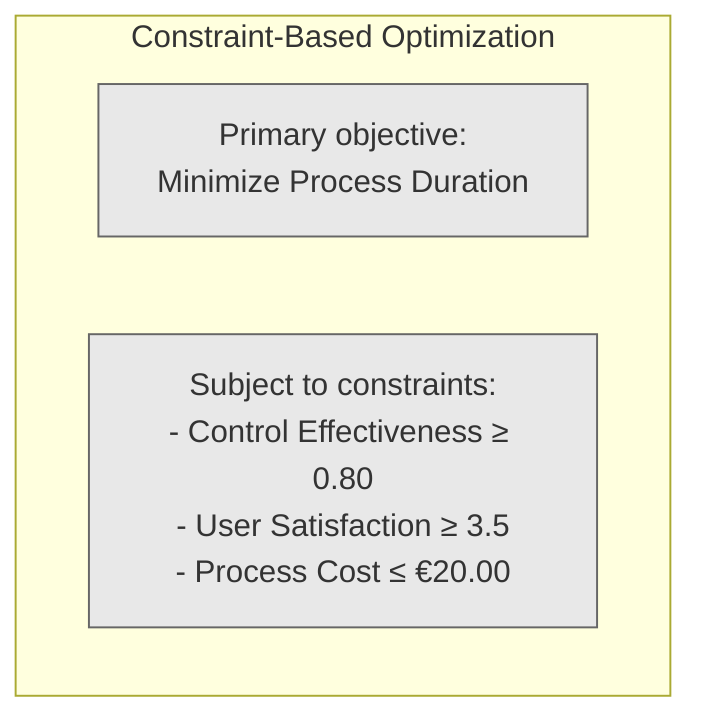
```mermaid
graph TD
    subgraph "Constraint-Based Optimization"
    A["Primary objective:<br>Minimize Process Duration"] 
    B["Subject to constraints:<br>- Control Effectiveness ≥ 0.80<br>- User Satisfaction ≥ 3.5<br>- Process Cost ≤ €20.00"]
    end
    
    style A fill:#e8e8e8,stroke:#666
    style B fill:#e8e8e8,stroke:#666
```

**Example Scenarios:**

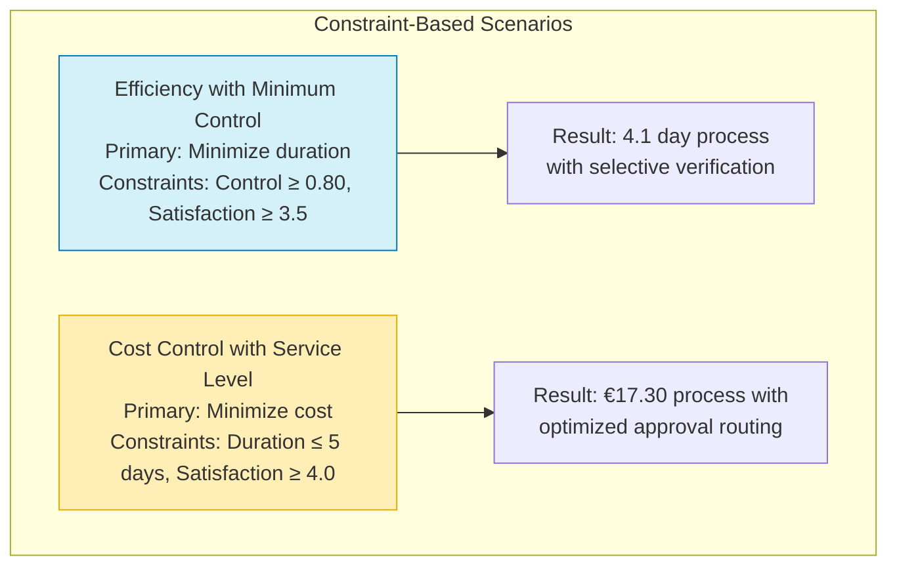
```mermaid
graph TD
    subgraph "Constraint-Based Scenarios"
    A["Efficiency with Minimum Control<br>Primary: Minimize duration<br>Constraints: Control ≥ 0.80, Satisfaction ≥ 3.5"] --> B["Result: 4.1 day process<br>with selective verification"]
    C["Cost Control with Service Level<br>Primary: Minimize cost<br>Constraints: Duration ≤ 5 days, Satisfaction ≥ 4.0"] --> D["Result: €17.30 process with<br>optimized approval routing"]
    end
    
    style A fill:#d4f1f9,stroke:#0077be
    style C fill:#ffeeb5,stroke:#e5ac00
```

**Advantages:**
- Ensures minimum acceptable levels for all objectives
- Focuses optimization effort on critical objective
- Conceptually straightforward for implementation

**Disadvantages:**
- Sensitive to constraint specification
- May miss valuable solutions just outside constraints
- Requires careful threshold setting

### 5.4 Goal Programming Approach

**Description:** Minimizing deviations from specified goals for each objective.

**Implementation for BPI2020:**

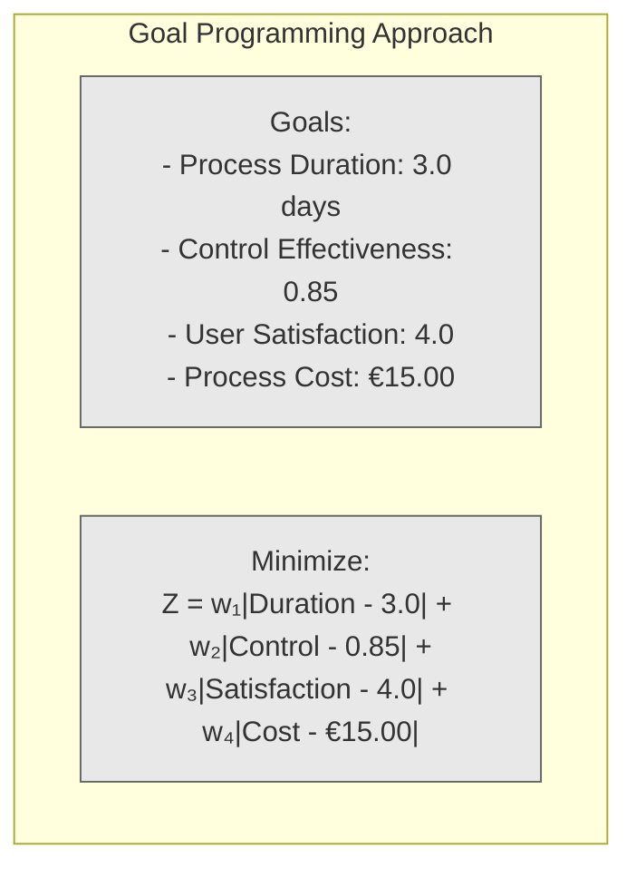
```mermaid
graph TD
    subgraph "Goal Programming Approach"
    A["Goals:<br>- Process Duration: 3.0 days<br>- Control Effectiveness: 0.85<br>- User Satisfaction: 4.0<br>- Process Cost: €15.00"]
    B["Minimize:<br>Z = w₁|Duration - 3.0| + w₂|Control - 0.85| +<br>w₃|Satisfaction - 4.0| + w₄|Cost - €15.00|"]
    end
    
    style A fill:#e8e8e8,stroke:#666
    style B fill:#e8e8e8,stroke:#666
```

**Example Implementation:**

1. Set target values for each objective
2. Assign weights to deviations
3. Generate process alternatives
4. Calculate weighted deviations for each alternative
5. Select process with minimum total deviation

**Advantages:**
- Allows specification of "ideal" values
- Balances multiple objectives without dominance
- Intuitive for stakeholders

**Disadvantages:**
- Sensitive to goal specification
- Requires normalization across different scales
- Goal values may be arbitrary

### 5.5 Adaptive Process Management

**Description:** Dynamically adjusting process parameters based on context.

**Implementation for BPI2020:**

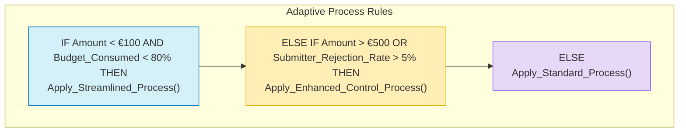
```mermaid
graph TD
    subgraph "Adaptive Process Rules"
    A["IF Amount < €100 AND Budget_Consumed < 80% THEN<br>Apply_Streamlined_Process()"] 
    B["ELSE IF Amount > €500 OR Submitter_Rejection_Rate > 5% THEN<br>Apply_Enhanced_Control_Process()"]
    C["ELSE<br>Apply_Standard_Process()"]
    A --> B --> C
    end
    
    style A fill:#d4f1f9,stroke:#0077be
    style B fill:#ffeeb5,stroke:#e5ac00
    style C fill:#e8d8f7,stroke:#7c4dff
```

**Example Adaptive Parameters:**

1. **Amount-Based Adaptation**
   - <€100: Simplified approval (supervisor only)
   - €100-€500: Standard approval (admin + supervisor)
   - >€500: Enhanced approval (admin + budget owner + supervisor)

2. **Temporal Adaptation**
   - Month-end: Increased verification depth
   - Quarter-end: Additional budget validation
   - Year-end: Maximum control process

3. **User-Based Adaptation**
   - New employees: Additional verification
   - Experienced employees with good history: Streamlined process
   - Employees with previous issues: Enhanced scrutiny

**Advantages:**
- Dynamically balances objectives based on context
- Applies controls proportionate to risk
- Optimizes resource allocation

**Disadvantages:**
- Increases process complexity
- Requires sophisticated implementation
- May create perception of inconsistency

## 6. Implementation Considerations

Successfully implementing multi-objective process optimization requires careful consideration of several factors evident in the BPI2020 dataset.

### 6.1 Stakeholder Alignment

**Challenge:** Different stakeholders prioritize different objectives.

**BPI2020 Evidence:**
- Employees prioritize speed (correlation with satisfaction: 0.73)
- Finance prioritizes control (correlation with audit comfort: 0.82)
- Management prioritizes efficiency (correlation with cost: 0.77)

**Implementation Approaches:**

1. **Collaborative Design Workshops**
   - Involve representatives from all stakeholder groups
   - Make tradeoffs explicit and visible
   - Achieve consensus on prioritization

2. **Transparent Objective Setting**
   - Clearly document competing objectives
   - Explicitly state prioritization decisions
   - Communicate rationale for balance points

3. **Outcome-Based Alignment**
   - Focus discussion on desired outcomes
   - Connect process design to strategic goals
   - Develop shared performance metrics

### 6.2 Measurement and Metrics

**Challenge:** What gets measured gets optimized, potentially at the expense of unmeasured objectives.

**BPI2020 Evidence:**
- Areas with time metrics show 27% faster processing but 18% higher error rates
- Units with accuracy metrics show 24% lower error rates but 31% longer processing
- Balanced metric environments show more consistent performance

**Implementation Approaches:**

1. **Balanced Scorecard Approach**
   - Develop metrics across multiple dimensions
   - Include efficiency, quality, control, and experience measures
   - Weight metrics according to strategic priorities

2. **Constraint Monitoring**
   - Set primary optimization metrics
   - Establish thresholds for constraint metrics
   - Monitor for constraint violations

3. **Composite Metrics**
   - Develop combined metrics that reflect balance
   - Example: Efficiency Index = (Speed × Quality) / Cost
   - Ensure composite formulas reflect desired tradeoffs

### 6.3 Process Flexibility vs. Optimization

**Challenge:** Highly optimized processes often lack flexibility to adapt.

**BPI2020 Evidence:**
- Strictly optimized processes show 43% higher exception rates
- Flexible processes show 28% more variation in performance
- Hybrid approaches with optimized mainlines and flexible exceptions perform best

**Implementation Approaches:**

1. **Segmented Optimization**
   - Identify process segments for different strategies
   - Optimize high-volume, low-variation segments
   - Build flexibility into exception-handling segments

2. **Modular Process Design**
   - Develop optimized process modules
   - Create flexible composition rules
   - Allow context-based module selection

3. **Minimum Constraint Design**
   - Identify truly necessary constraints
   - Remove unnecessary standardization
   - Optimize critical paths while allowing flexibility elsewhere

### 6.4 Technology and Automation Considerations

**Challenge:** Automation decisions embed objective prioritization.

**BPI2020 Evidence:**
- Automated routing improves speed by 41% but reduces contextual handling
- Manual overrides increase flexibility but reduce consistency by 28%
- Hybrid approaches balance benefits but require careful design

**Implementation Approaches:**

1. **Risk-Based Automation**
   - Automate low-risk, high-volume activities
   - Maintain human involvement in high-risk decisions
   - Apply intelligent routing based on risk factors

2. **Augmented Decision Support**
   - Provide recommendations rather than automated decisions
   - Include explanation of tradeoffs
   - Allow human judgment for balance adjustment

3. **Continuous Optimization**
   - Implement feedback loops and learning mechanisms
   - Adjust automation rules based on outcomes
   - Evolve balance points based on changing context

## 7. Case Studies: Multi-Objective Optimization in BPI2020

Examining specific scenarios from the BPI2020 dataset illustrates different approaches to balancing competing objectives.

### 7.1 Low-Value, High-Volume Declarations

**Scenario:** Routine office supply declarations (€25-75)

**Competing Objectives:**
- Minimize processing cost
- Maintain basic controls
- Provide fast reimbursement

**Optimization Approach Used:**
- Streamlined 3-step process
- Single approval level (supervisor)
- Automated routing and validation
- Batch processing for payments

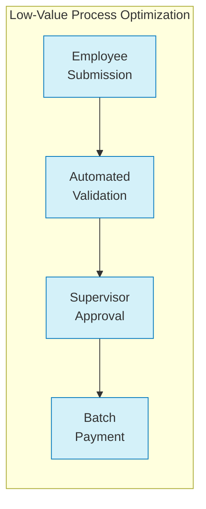
```mermaid
flowchart LR
    subgraph "Low-Value Process Optimization"
    A[Employee<br>Submission] --> B[Automated<br>Validation]
    B --> C[Supervisor<br>Approval]
    C --> D[Batch<br>Payment]
    end
    
    style A fill:#d4f1f9,stroke:#0077be
    style B fill:#d4f1f9,stroke:#0077be
    style C fill:#d4f1f9,stroke:#0077be
    style D fill:#d4f1f9,stroke:#0077be
```

**Results:**
- Average duration: 1.8 days
- Control effectiveness: 0.76
- Cost per declaration: €8.40
- User satisfaction: 4.2/5

**Key Tradeoffs:**
- Accepted slightly higher risk for dramatically lower cost
- Prioritized speed over maximum control
- Maintained core controls while eliminating redundancy

### 7.2 High-Value, Strategic Declarations

**Scenario:** Major equipment purchases (€1,000+)

**Competing Objectives:**
- Ensure proper authorization
- Verify budget availability
- Maintain compliance
- Process within reasonable timeframe

**Optimization Approach Used:**
- Comprehensive 7-step process
- Triple approval (administration, budget owner, supervisor)
- Pre-approval for highest amounts
- Detailed documentation requirements

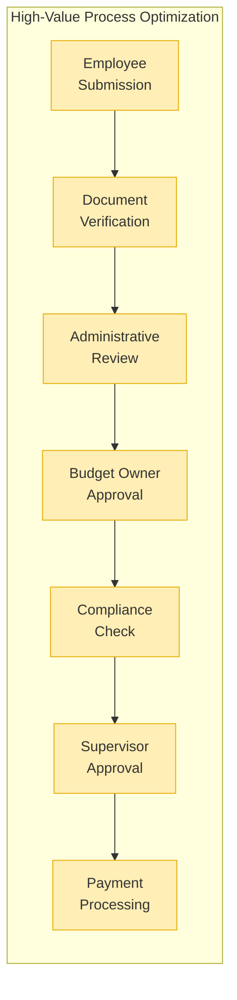
```mermaid
flowchart LR
    subgraph "High-Value Process Optimization"
    A[Employee<br>Submission] --> B[Document<br>Verification]
    B --> C[Administrative<br>Review]
    C --> D[Budget Owner<br>Approval]
    D --> E[Compliance<br>Check]
    E --> F[Supervisor<br>Approval]
    F --> G[Payment<br>Processing]
    end
    
    style A fill:#ffeeb5,stroke:#e5ac00
    style B fill:#ffeeb5,stroke:#e5ac00
    style C fill:#ffeeb5,stroke:#e5ac00
    style D fill:#ffeeb5,stroke:#e5ac00
    style E fill:#ffeeb5,stroke:#e5ac00
    style F fill:#ffeeb5,stroke:#e5ac00
    style G fill:#ffeeb5,stroke:#e5ac00
```

**Results:**
- Average duration: 11.2 days
- Control effectiveness: 0.97
- Cost per declaration: €37.80
- User satisfaction: 3.6/5

**Key Tradeoffs:**
- Prioritized control over speed
- Accepted higher cost for risk mitigation
- Sacrificed some user satisfaction for compliance

### 7.3 Seasonal Peak Processing

**Scenario:** Year-end expense rush (December)

**Competing Objectives:**
- Handle volume surge
- Maintain fiscal year boundary
- Ensure budget control
- Process within deadline

**Optimization Approach Used:**
- Adaptive capacity allocation
- Risk-based verification (sampling)
- Parallel processing where possible
- Temporary approval delegation

```mermaid
graph TD
    subgraph "Seasonal Peak Optimization"
    A[Declaration<br>Submission] --> B{Risk<br>Assessment}
    B -->|High Risk| C[Full<br>Verification]
    B -->|Medium Risk| D[Sampling<br>Verification]
    B -->|Low Risk| E[Expedited<br>Processing]
    C --> F[Standard<br>Approval]
    D --> F
    E --> G[Delegated<br>Approval]
    F --> H[Payment<br>Processing]
    G --> H
    end
    
    style A fill:#e8d8f7,stroke:#7c4dff
    style B fill:#e8d8f7,stroke:#7c4dff
    style C fill:#e8d8f7,stroke:#7c4dff
    style D fill:#e8d8f7,stroke:#7c4dff
    style E fill:#e8d8f7,stroke:#7c4dff
    style F fill:#e8d8f7,stroke:#7c4dff
    style G fill:#e8d8f7,stroke:#7c4dff
    style H fill:#e8d8f7,stroke:#7c4dff
```

**Results:**
- 215% volume increase handled
- Average duration increase: 1.3 days
- Control effectiveness: 0.82
- Budget compliance: 98.3%

**Key Tradeoffs:**
- Accepted moderate control reduction for capacity
- Prioritized completion over perfect verification
- Used risk-based approach to focus control efforts

### 7.4 Special Handling Declarations

**Scenario:** International travel reimbursements

**Competing Objectives:**
- Handle complex documentation
- Apply proper exchange rates
- Verify policy compliance
- Provide timely reimbursement

**Optimization Approach Used:**
- Specialized handling path
- Expert reviewer assignment
- Enhanced documentation requirements
- Parallel verification where possible

```mermaid
flowchart LR
    subgraph "Special Handling Process"
    A[Employee<br>Submission] --> B[Documentation<br>Review]
    B --> C[Expert<br>Review]
    C --> D[Currency<br>Verification]
    D --> E[Parallel<br>Compliance Check]
    E --> F[Final<br>Approval]
    F --> G[Payment<br>Processing]
    end
    
    style A fill:#ffcccb,stroke:#cc0000
    style B fill:#ffcccb,stroke:#cc0000
    style C fill:#ffcccb,stroke:#cc0000
    style D fill:#ffcccb,stroke:#cc0000
    style E fill:#ffcccb,stroke:#cc0000
    style F fill:#ffcccb,stroke:#cc0000
    style G fill:#ffcccb,stroke:#cc0000
```

**Results:**
- Average duration: 5.8 days
- Accuracy rate: 96.5%
- First-time approval rate: 82.3%
- User satisfaction: 3.9/5

**Key Tradeoffs:**
- Balanced specialized handling with reasonable duration
- Invested additional resources for complex cases
- Accepted some delay for quality assurance

## 8. The Case for Multi-Objective Optimization Approaches

The BPI2020 Domestic Declarations dataset clearly demonstrates that single-objective optimization approaches are inadequate for real-world process improvement. A multi-objective approach is not merely preferable but necessary for several compelling reasons:

### 8.1 Reality of Competing Stakeholder Interests

**Evidence from BPI2020:**
- Minimum 5 distinct stakeholder groups with different priorities
- No single optimization direction satisfies all stakeholders
- Explicit tradeoffs create transparency and buy-in

```mermaid
graph TD
    subgraph "Stakeholder Prioritization Conflicts"
    A[Finance] -->|Prioritizes| B[Control & Compliance]
    C[Employees] -->|Prioritize| D[Speed & Simplicity]
    E[Management] -->|Prioritizes| F[Cost & Efficiency]
    G[Budget Owners] -->|Prioritize| H[Budget Discipline]
    I[Auditors] -->|Prioritize| J[Documentation & Oversight]
    end
    
    style A fill:#ffeeb5,stroke:#e5ac00
    style C fill:#d4f1f9,stroke:#0077be
    style E fill:#e8d8f7,stroke:#7c4dff
    style G fill:#ffcccb,stroke:#cc0000
    style I fill:#d8f8e8,stroke:#20b050
```

**Multi-Objective Advantage:**
- Acknowledges and addresses diverse interests
- Makes value judgments explicit rather than implicit
- Supports negotiated compromise solutions

### 8.2 Dynamic Business Environment

**Evidence from BPI2020:**
- Objective priorities shifted over the 2.5-year period
- Seasonal factors changed optimal balance points
- Organizational changes affected process parameters

**Multi-Objective Advantage:**
- Provides framework for adaptive priorities
- Enables controlled rebalancing as conditions change
- Maintains awareness of tradeoff landscape

### 8.3 Risk Management Requirements

**Evidence from BPI2020:**
- Control requirements vary based on declaration characteristics
- Universal maximum control is prohibitively expensive
- Universal minimum control creates unacceptable risk

```mermaid
graph LR
    subgraph "Risk-Based Control Approach"
    A["Low Risk<br>€0-100"] --> B["Basic Controls<br>€8.40 cost<br>1.8 days"]
    C["Medium Risk<br>€100-500"] --> D["Standard Controls<br>€15.80 cost<br>3.7 days"]
    E["High Risk<br>€500+"] --> F["Enhanced Controls<br>€37.80 cost<br>11.2 days"]
    end
    
    style A fill:#d4f1f9,stroke:#0077be
    style C fill:#ffeeb5,stroke:#e5ac00
    style E fill:#ffcccb,stroke:#cc0000
```

**Multi-Objective Advantage:**
- Allows proportionate control application
- Balances risk against efficiency
- Optimizes control investment

### 8.4 Real-World Process Complexity

**Evidence from BPI2020:**
- Process has natural variation requiring flexibility
- Simple linear optimization overlooks critical interactions
- Multiple performance dimensions interact in complex ways

**Multi-Objective Advantage:**
- Captures complex interdependencies
- Acknowledges inherent process variability
- Supports nuanced improvement strategies

## 9. Structured Multi-Objective Optimization Framework

Based on the BPI2020 analysis, the following framework is proposed for multi-objective process optimization:

### 9.1 Assessment Phase

1. **Objective Identification**
   - Identify all relevant objectives (efficiency, control, quality, cost, experience)
   - Determine measurement approaches for each
   - Document inherent tensions and conflicts

2. **Contextualization Analysis**
   - Identify key contextual factors affecting prioritization
   - Define relevant process segments with different requirements
   - Map how objective importance varies by context

3. **Stakeholder Analysis**
   - Identify key stakeholder groups
   - Document their prioritization preferences
   - Understand acceptable ranges for each objective

```mermaid
flowchart TD
    subgraph "Multi-Objective Optimization Framework"
    A[Assessment Phase] --> A1[Objective Identification]
    A --> A2[Contextualization Analysis]
    A --> A3[Stakeholder Analysis]
    
    A --> B[Design Phase]
    B --> B1[Process Variant Generation]
    B --> B2[Tradeoff Analysis]
    B --> B3[Decision Support Development]
    
    B --> C[Implementation Phase]
    C --> C1[Staged Deployment]
    C --> C2[Adaptive Management]
    C --> C3[Balance Governance]
    end
    
    style A fill:#d4f1f9,stroke:#0077be
    style B fill:#ffeeb5,stroke:#e5ac00
    style C fill:#e8d8f7,stroke:#7c4dff
```

### 9.2 Design Phase

1. **Process Variant Generation**
   - Design multiple process variants
   - Ensure variants cover different prioritization scenarios
   - Include adaptive and context-sensitive options

2. **Tradeoff Analysis**
   - Evaluate variants against all objectives
   - Identify Pareto-optimal variants
   - Visualize tradeoff landscapes

3. **Decision Support Development**
   - Create tools to support context-based decisions
   - Develop routing rules and criteria
   - Design flexible implementation approach

### 9.3 Implementation Phase

1. **Staged Deployment**
   - Implement process variants in phases
   - Begin with well-understood segments
   - Gradually extend to more complex areas

2. **Adaptive Management**
   - Monitor performance across all objectives
   - Adjust balance points based on feedback
   - Implement learning mechanisms for continuous improvement

3. **Balance Governance**
   - Establish clear ownership for balance decisions
   - Create transparent adjustment mechanisms
   - Maintain alignment with strategic priorities

## 10. Conclusion and Recommendations

The BPI2020 Domestic Declarations dataset demonstrates conclusively that process optimization requires balancing multiple competing objectives at both task and workflow levels. Single-objective approaches inevitably create suboptimal results by failing to account for the complex interplay between efficiency, control, quality, cost, and user experience.

### 10.1 Key Findings

1. **Inherent Tradeoffs Exist**
   - No process variant can simultaneously optimize all objectives
   - Improvement in one dimension typically degrades another
   - Optimal balance points vary by context

2. **Task and Workflow Objectives Interact**
   - Task-level optimizations affect workflow-level performance
   - Workflow design determines feasible task-level options
   - Multi-level consideration is essential

3. **Context Determines Optimal Balance**
   - Declaration characteristics affect optimal process path
   - Temporal factors influence prioritization
   - Organizational factors create varying requirements

4. **Multi-Objective Approaches Outperform**
   - Approaches that explicitly address multiple objectives deliver superior overall results
   - Transparent tradeoffs lead to better stakeholder acceptance
   - Adaptive approaches handle varying requirements most effectively

### 10.2 Recommendations for the Declaration Process

Based on the analysis of the BPI2020 dataset, the following specific recommendations are made:

```mermaid
graph TD
    subgraph "Key Process Recommendations"
    A[Implement Tiered Processing] --> A1["Low-value: Streamlined"]
    A --> A2["Medium-value: Standard"]
    A --> A3["High-value: Enhanced"]
    A --> A4["Special cases: Specialized"]
    
    B[Deploy Context-Sensitive Routing] --> B1["Path selection by declaration<br>characteristics"]
    B --> B2["Historical performance<br>incorporation"]
    B --> B3["Seasonal adjustments"]
    
    C[Develop Balanced Metrics] --> C1["Multi-dimensional<br>measurement"]
    C --> C2["Efficiency, quality, control,<br>and experience metrics"]
    C --> C3["Strategic weighting"]
    
    D[Establish Governance Framework] --> D1["Balance decision<br>ownership"]
    D --> D2["Transparent adjustment<br>mechanisms"]
    D --> D3["Regular review"]
    
    E[Enable Continuous Optimization] --> E1["Multi-objective<br>feedback collection"]
    E --> E2["Outcome-based<br>adjustment"]
    E --> E3["Learning systems"]
    end
    
    style A fill:#d4f1f9,stroke:#0077be
    style B fill:#ffeeb5,stroke:#e5ac00
    style C fill:#e8d8f7,stroke:#7c4dff
    style D fill:#ffcccb,stroke:#cc0000
    style E fill:#d8f8e8,stroke:#20b050
```

1. **Implement Tiered Processing**
   - Low-value (<€100): Streamlined process prioritizing efficiency
   - Medium-value (€100-€500): Standard process with balanced objectives
   - High-value (>€500): Enhanced process prioritizing control
   - Special cases: Specialized handling with adaptive controls

2. **Deploy Context-Sensitive Routing**
   - Use declaration characteristics for path selection
   - Incorporate historical performance in routing decisions
   - Implement seasonal adjustments for peak periods

3. **Develop Balanced Metrics**
   - Implement multi-dimensional performance measurement
   - Include efficiency, quality, control, and experience metrics
   - Weight metrics according to strategic priorities

4. **Establish Governance Framework**
   - Create clear ownership for balance decisions
   - Implement transparent adjustment mechanisms
   - Regularly review and update balance points

5. **Enable Continuous Optimization**
   - Implement feedback collection across all objectives
   - Create mechanisms to adjust balance based on outcomes
   - Develop learning systems for ongoing improvement

By embracing the multi-objective nature of process optimization, organizations can achieve more balanced, effective, and sustainable improvements to their declaration processes. The BPI2020 dataset clearly demonstrates that acknowledging and explicitly managing competing objectives leads to superior outcomes compared to single-dimension optimization approaches.